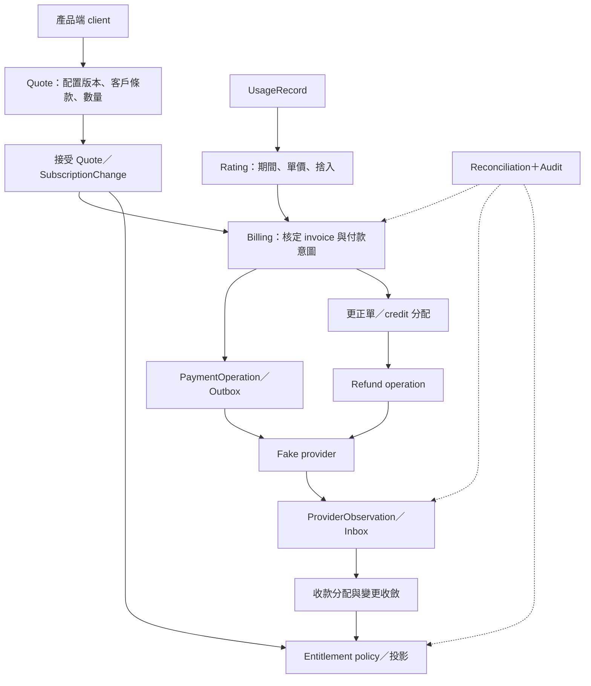

# Billforge：研究綜合、MVP 方案與概念推演計畫

日期：2026-09-26；狀態更新：2026-09-28。**A–D 為設計推演；E、F1–F8、P01–P03 已有本機切片，Web Admin C01–C49 已接線、完整驗收進行中。整體 MVP 尚未經生產驗證，各項完成條件與未完成矩陣以完成追蹤及實作紀錄為準。**

本方案整合使用者提供的商務平台後端職務需求、第一份 correctness MVP 需求、第二份資深工程範圍補充，以及 [34 份開源調查](research/README.md)。研究限於公開程式與文件；A–D 選擇政策、畫清邊界並推演情境，E、F1–F8 與 P01–P03 已建立自己的本機 lab 切片。不需要部署任何被調查的專案。

A–D 的具體推演已整理於 [設計文件索引](design/README.md)：計價政策、事實與狀態、12 個故障情境、對帳修復，以及 API 與價格遷移契約。設計仍用來界定規則；哪些路徑已有實作與證據，另依 [MVP 完成追蹤](implementation/mvp-completion-tracker.md)判斷，不把整份設計等同完整實作。

## 1. 建議方向與目前掌握的證據

建議建立 **Billforge Commerce Correctness Lab**：維持 Go、SQLite、單一程式與可控制的 FakePaymentProvider，用有限的定價元件覆蓋完整的商務生命週期。核心能力是讓產品團隊能安全變更方案，並能解釋每筆金額、每次服務開通與每項修復。

工作區已依 [MVP 完成追蹤](implementation/mvp-completion-tracker.md)建立 E、F1–F8 與 P01–P03 的本機切片。34 份調查提供可比較的概念和來源；這些切片不能據此宣稱 Billforge 已具有完整金融保證。原需求中的綠／黃／紅能力表亦應讀作「計畫覆蓋面」，不是使用者能力或系統成熟度的評分。

[互動式選單 CLI](implementation/interactive-cli.md)已能操作和查詢上述本機切片；[loopback v1 API](implementation/phase-p2-v1-api.md)與[帳戶邊界遷移演練](implementation/phase-p3-account-cutover.md)提供本機操作證據。正式對外 API、完整授權與生產營運介面仍需獨立設計與驗證。

| 資訊來源 | 對方案的約束 |
| --- | --- |
| 第一份 MVP 需求 | 金額、歷史、冪等、UNKNOWN、failure handling、reconciliation、entitlement 是核心；Go＋SQLite，避免過早引入基礎設施。 |
| 第二份範圍補充 | 補齊續約、升降級、proration、billing close、Net30 合約、grandfathering、API 相容性與遷移。 |
| 商務平台職務需求 | 同時重視 pricing／packaging 的交付速度、平台採用、營收準確性、營運、效能及跨團隊取捨。 |
| 34 份研究 | 支持拆開價格配置、已承諾金額、支付操作、服務權益與更正；各專案的商業政策與執行保證不可直接移植。 |

這個 lab 可以產出架構判斷、可解釋的故障處理及 API 演進證據。真實規模的營運經驗、跨團隊領導成果、轉換率或 ARR 改善，仍需要實際工作證據補足。

## 2. 研究綜合：哪些概念應進入方案

| 共通概念 | 研究提供的線索 | Billforge 的建議 |
| --- | --- | --- |
| 價格配置有版本，既有訂閱有指派 | OpenMeter、Kill Bill、Lotus、Meteroid | 發布 v2 不改既有客戶；價格版本、客戶指派與 migration 分開。 |
| 預覽與財務事實有明確分界 | Magento、Shopware、Oscar、Medusa、Flexprice | Quote 記錄上下文、有效期與版本；接受後形成持久 intent；invoice 核定固化金額。 |
| 用量、計價、開票分開 | Lago、OpenMeter、Portcall、Kimai、Tryton | Usage 保存事實；Rating 保存計算依據；Invoice 保存核定結果。 |
| 金流意圖和外部觀察分開 | Kill Bill、Hyperswitch、Saleor、Active Merchant | Operation、Attempt、ProviderObservation 各有身分；UNKNOWN 需要查證。 |
| 應收更正、信用額度和退款不同 | Solidus、Lago、Bigcapital、ERPNext、Formance | Adjustment／CreditNote、CreditAllocation、Refund 保留來源鏈及共同額度限制。 |
| 服務權益有自己的政策 | Kill Bill、OpenMeter、Odoo、Dolibarr | 欠款、合約條款與寬限期共同決定權益，付款狀態不能直接代替權益。 |
| 可擴充介面仍需版本與營運政策 | WooCommerce、Vendure、Sylius、Bagisto、Cashier | 穩定 API、單一寫入責任、快取失效、舊 client 行為與安全 rollout 一起設計。 |

**研究中的分歧必須成為明文政策。** 例如晚到用量算本期還是回溯更正、未付 invoice 的 credit 是否可退款、改價是否自動影響舊訂閱，都沒有跨專案通用答案。下節提出一組適合 lab 的預設，保留改動理由與後果。

## 3. 有界的業務範圍與建議預設

以下為工作假設，不把它們描述成使用者已核准的政策。

| 項目 | 建議預設 | 有意限制 |
| --- | --- | --- |
| 產品與方案 | 一個 Automation 產品；Basic、Pro 為方案。Basic $20／月；Pro $50＋$10 × 席次／月。 | Pro 的 seat quantity 是付費總席次，沒有隱含免費席次；一般訂閱至少一席。 |
| 定價元件 | FixedCharge、PerSeatCharge、IncludedQuantity、UsageOverage。 | PriceDefinition 作版本內的值物件；先不做任意 DSL、促銷引擎或所有 tier 模式。 |
| 計費時間 | 固定費／席次預付；用量後付。USD、UTC 月週期，區間為 [start, end)。 | 保存原月日錨點；短月份截到月底，下一月回到原錨點。 |
| 用量 | Pro 後續版本含每期 20,000 tasks，超額 $0.001／task。 | included quantity 是計價 allowance，**不等於停止服務的 hard quota**。 |
| 新購與續約 | 自助新購付款確認後開通；續約逾期後有 7 天服務寬限。 | Invoice due date、重試排程、grace deadline 分別保存；寬限可配置且有政策版本。 |
| 一般方案變更 | 升／降級均可排到下期；另做一次期中立即升級推演。 | 第一期不支援同日多次回溯變更；用 version precondition 阻止衝突。 |
| Proration | 預設以 UTC 實際剩餘秒數／整期秒數計算比例，保留精確中間值再按行捨入。 | 比例公式與服務生效政策分開；付款延遲跨過生效點仍需完成下述推演。 |
| 取消與恢復 | 支援期末取消，以及結束前撤銷取消。 | 結束後重新購買建立新服務期間；不自動抹掉取消歷史。 |
| 舊客價格 | 指派釘選，發布新價只影響新指派；舊客透過明確 migration 更新。 | 不用 current price 重新解釋歷史交易。 |
| 企業合約 | Acme：$40＋$7 × 席次，Net30，合約版本有有效區間；尚未到期可先啟用服務。 | 只做一種合約覆寫；變更／到期對齊帳期邊界，要求明確的到期後指派，缺少時轉人工處理。 |
| Billing close | 固定輸入截止序號／時間與 rating revision；核定後的晚到用量形成後續差額。 | 正差額放下一張帳單並標原服務期；負差額走更正單；不重寫已核定 invoice。 |
| 金額 | 交易金額為整數 cents；單價／中間計算用精確十進位或有理數。 | 每個「計費元件 × 服務區段」先聚合再捨入至 cents，採 half-even；規則也要版本化。 |
| 支付 | 一個可查詢、支援穩定 operation key 的 FakePaymentProvider。 | 初期只做直接 capture／refund；授權再 capture 留作模型擴充點。 |

Tax、多幣別、全球 merchant-of-record、完整 ERP、通用總帳及真實 Stripe 整合不進入這個 MVP。Revenue Recognition 保留架構介面與來源事件說明；invoice、收款和實現收入不視為同一件事。

**期中升級遇到 UNKNOWN 是第一個必須完成的政策推演。** 建議主流程採付款確認後才提升有效方案；但 quote 的生效時間一旦早於實際開通時間，就不能假裝期間完全相同。推演必須選定「重新報價並處理舊付款」或「保留原價、另給延遲服務補償」等政策，禁止事後無聲改價。這個組合情境未解決前，不將立即升級標成完整驗收。

## 4. 最小領域模型與事實所有權

每一行是邏輯模組，不代表獨立服務；每個名字也不強制對應一張資料表。先從場景辨識必須持久化的身分與事實，值物件可以內嵌。跨模組以命令／查詢交換資料，由 application workflow 協調。

| 模組 | 最小物件 | 事實與狀態由誰負責 |
| --- | --- | --- |
| Account reference | Customer、BillingAccountRef、BeneficiaryRef | 客戶、付費主體、服務使用主體分別有穩定 ID；lab 可讓它們一對一，但不把帳號認證資料搬進 Commerce。 |
| Catalog／Pricing | Product、Plan、PriceVersion、PriceDefinition、Quote | 已發布價格配置不可原地改；Quote 是有期限的計算快照，保存版本、數量、條款及預計現在／未來收費。 |
| Subscription／Terms | Subscription、SubscriptionChange、SubscriptionPricingAssignment、CustomerContractVersion | 商業意圖、有效方案、服務期間和未來變更分開；指派同時參照價格與權益政策版本。 |
| Measurement／Billing | UsageRecord、UsageAssignment、RatingResult、BillingRun、Invoice、InvoiceLine | 原始用量不可改寫；rating 可有新 revision；finalized line 的來源、精度與金額不可重寫。 |
| Receivables／Corrections | Adjustment／CreditNote、CreditMovement、Allocation | 保存應收更正、付款分配、credit 的來源及使用；餘額是可重建投影。這是有限應收紀錄，不宣稱完整會計總帳。 |
| Payments | PaymentIntent、PaymentOperation、PaymentAttempt、ProviderObservation、Refund | Intent 是欲支付的義務；Operation 是外部經濟效果；Attempt 是一次傳輸；Observation 是帶來源的觀察。 |
| Entitlements | EntitlementPolicyVersion、EntitlementProjection | 權益由有效訂閱、合約、付款／欠款及時間政策導出，記錄原因和使用的來源版本。 |
| Operations | ReconciliationRun、Discrepancy、RepairOperation、AuditEvent、Inbox／Outbox | 保存缺口、證據、分類、修復與驗證；不能以修復程式繞過領域限制。 |

PriceVersion 的可購買生效時間不等於「舊訂閱自動變價」。ContractOverride 只覆寫明確允許的欄位，先解析既有 pricing assignment，再套有效合約；缺價、重疊有效期、未知元件均明確拒絕。

訂閱不使用混合所有概念的萬用 status：

- 商業生命週期：pending、active、ended；另存 cancel_at 與 scheduled changes。
- 收款／欠款：current、open、past_due，依具體 invoice 和 due date 判定。
- PaymentOperation：created、submitted、pending／unknown、succeeded、definitively_failed。
- 權益：active、grace、suspended、expired；來源和生效區間可查。

因此「要求 Pro、有效方案仍 Basic、invoice open、payment unknown、Basic 權益 active」是可解釋的中間狀態。Net30 則可合法出現「有效 Pro、invoice open、尚未收款、Pro 權益 active」。

## 5. 流程與原子邊界

Quote 不等於 Invoice。Quote 可說「現在應收 $100；未來固定 $100／期；tasks 超額費按實際使用後付」，不能把未知的未來用量包成已承諾的月總價。

| 邊界 | 同一個本地交易內的事 | 交易外的事與恢復方式 |
| --- | --- | --- |
| 接受 Quote | 檢查有效期、客戶／訂閱版本與 fingerprint；建立 change intent、operation identity、audit。 | 若版本已變更，回明確衝突並重新報價；若已成功接受，重試回同一結果。 |
| Invoice 核定 | 鎖／版本檢查、固定 input set、line snapshots、核定號碼及相關唯一鍵。 | 只發布已提交的 outbox；不能一半核定、一半改用新價格。 |
| 發出付款 | 保存固定 amount／currency／provider key 的 operation 和 dispatch 工作。 | Provider call 不包在本地 DB transaction 內；逾時記 unknown 並查詢原操作。 |
| 消費回報 | Inbox 去重、驗證觀察適用性、更新 operation／allocation、寫 audit／後續工作。 | 舊事件不覆蓋較新真相；無可用因果順序時查 provider，不只比事件時間。 |
| 退款／credit 使用 | 對同一來源額度保留或扣減，保存退款 intent、唯一身分及工作。 | UNKNOWN 保留預算；確認成功才完成，確認無外部效果才釋放。 |
| 更新權益 | 根據已提交來源與 policy version 建投影，保存 source revision。 | 重跑可得到同一結果；中途崩潰可由 outbox 或 reconciliation 補上。 |

未來若實作 fake provider，讓它使用**獨立持久狀態／獨立交易**，例如同一程式中的第二個 SQLite 檔案。否則將 provider 與 Commerce 放進同一 transaction，會掩蓋「遠端成功、本地失敗」這個核心情境。

各種重試需要不同的穩定身分；API request key 和經濟效果 key 不能混為一談：

| 操作 | 建議身分與作用範圍 |
| --- | --- |
| Subscribe／ChangeSubscription | billing account＋client＋request key，另以 accepted quote ID 防止同一接受動作換 key 重做。 |
| Generate invoice | subscription＋service period＋charge group 的原始開票義務；重跑不換身分。核定後的更正使用另外的 correction ID。 |
| Charge | provider account＋PaymentOperation ID；amount／currency 固定。更換 operation 必須先證明前次沒有外部效果，並檢查義務的剩餘可收金額。 |
| Process webhook | provider account＋event ID；不同 event 指向同一 operation，也只能造成一次對應財務效果。 |
| ReportUsage | tenant＋source＋event ID，附內容 fingerprint；改 timestamp 不形成新的重送身分。 |
| Refund | 原 capture＋refund business operation ID；所有 attempts 使用同一 provider key，並共用可退額保留機制。 |
| Repair | discrepancy＋action＋source revision；來源變更先重新分類，不沿用已失效的修復前置條件。 |

## 6. 第一版不可違反的條件

| ID | 不變條件 | 應能看見的證據 |
| --- | --- | --- |
| I01 | Invoice.Total 等於核定 InvoiceLine.Amount 的總和；幣別一致。 | 行項和總額、捨入政策版本。 |
| I02 | 單價與 rating 中間值可精確表示；不使用 binary float 決定應收。 | 原數量、精確率、未捨入值與最終 cents。 |
| I03 | 已發布／已引用價格及核定金額不原地修改。 | immutable version、原 line snapshot、新更正紀錄。 |
| I04 | 每一已承諾收費都能指向 pricing assignment、contract／policy 和服務期間。 | 完整 provenance。 |
| I05 | 同客戶同服務範圍的有效 pricing assignment 不產生未定義的重疊。 | 有效區間與 migration 決策。 |
| I06 | 接受 Quote 使用已驗證的上下文；已送出的 payment amount 不由 current price 重算。 | quote fingerprint、subscription revision、operation payload hash。 |
| I07 | 同一 operation 重試不可重複 capture；同一義務的已收與未決保留不超過授權可收額。 | 義務身分、operation key、收款 reservation、provider 查詢與 allocation。 |
| I08 | 同 idempotency key 同 payload 回原結果；同 key 不同 payload 明確衝突。 | 持久 key 範圍、payload hash、原結果。 |
| I09 | UNKNOWN／PENDING 不代表沒有外部效果，也不能直接放行第二次收款。 | 非最終狀態與後續觀察。 |
| I10 | Webhook 重複或亂序不產生第二次財務效果、也不讓已確認成功倒退。 | inbox event ID、operation revision、觀察衝突紀錄。 |
| I11 | 同來源事件身分不能代表兩組用量事實；重送不增加計費用量。 | tenant＋source＋event ID、payload fingerprint。 |
| I12 | 每筆用量有明確歸期；重讀事件作差額計算可以，重複收取同一經濟效果不可以。 | UsageAssignment、rating revision、已入帳差額合計。 |
| I13 | Billing close 後的更正不改原核定 invoice。 | 原帳單與後續 debit／credit 來源鏈。 |
| I14 | 已退金額＋尚未決定的退款保留額不得超過可退款 capture。 | 同付款的 reservation 與成功退款合計。 |
| I15 | Credit 的已套用、已退款及保留額不超過有來源的 grant。 | 分配／釋放紀錄；同一 credit 不能同時抵帳又退現金。 |
| I16 | 修正未付應收不憑空形成可退款現金。 | 原發票、已付／未付部分、credit 的資金來源。 |
| I17 | 權益變動能由來源事實、政策版本與時鐘解釋；不等於 paid 布林值。 | entitlement reason、effective interval、source revision。 |
| I18 | 重要本地轉移及其 audit／待發工作原子提交。 | transaction boundary、outbox；外部操作另有恢復路徑。 |
| I19 | Discrepancy 保留 expected、actual、來源、觀察時間與分類，不能只覆寫錯誤值。 | reconciliation evidence bundle。 |
| I20 | Repair 有穩定身分、執行前置條件與事後核對，重跑不能再造成一次效果。 | repair revision、idempotency key、驗證結果。 |
| I21 | 已確認支付成功，在 worker／查詢可用且政策允許時，帳款、變更及權益最終收斂。 | 可重跑工作與停滯告警；無法取得外部真相時允許轉人工處理，不虛稱必然自動收斂。 |

這些條件是 Billforge 的設計要求。研究中的欄位、鎖或狀態名稱，只提供線索，沒有替我們證明以上條件。

## 7. 用數字先推演，避免漂亮模型掩蓋政策

**月費與用量。** Pro 五席固定費為 $50＋$10 × 5＝$100。使用 53,241 tasks，超額 33,241 × $0.001＝$33.241，按本方案規則成為 $33.24 的 usage line。若與固定費同張開票，總額為 $133.24；若分開開票，也應能對應同一服務期。

**Proration。** 服務期 [2026-09-01 00:00Z, 2026-10-01 00:00Z)，在 09-16 00:00Z 從 Basic 升為 Pro 五席：剩餘比例 15／30，未用 Basic 抵扣 −$10，Pro 剩餘期間 +$50，淨收 $40。原需求的 $15 範例只比較 $20 與 $50 的基礎費，沒有含席次；完整 quote 不能漏掉席次。保留兩條計算來源，不只保存淨額。

這個正淨額案例建議以獨立的補差額 invoice 表達兩條 signed lines，原 Basic invoice 不改；−$10 已在該文件抵銷 +$50，不能再產生另一份可花用的 $10 credit。若變更確定取消，整筆補差額義務也要有可追溯的撤銷／更正；UNKNOWN 時不能先假定取消。延遲服務的補償政策仍是 S07 的通過條件。

**晚到用量。** 原已計價 53,244 tasks：$33.244 → $33.24。關帳後再到四筆 task，同一原期間累計應為 $33.248 → $33.25，差額是 $0.01。若只計晚到四筆，$0.004 會捨入為 $0.00。更正應以「同一原政策下的累計應收 − 已入帳金額」計算，避免重給 included quantity 或逐批捨入遺失金額。

**Credit 與退款。** 原 invoice $100、更正 −$20：

| 更正前情況 | 更正後應收／credit | 允許的後續 |
| --- | --- | --- |
| 尚未收款 | 剩餘應收 $80，沒有現金來源 credit。 | 收款 $80。 |
| 已收 $60 | 剩餘應收 $20，沒有可退的 $20。 | 收款 $20。 |
| 已收 $100 | 原 invoice 金額不改；淨義務 $80，$20 從原付款分配釋出為有來源 credit。 | $20 可抵未來帳或退款；共用額度，不能兩者都做。 |

釋出分配以新的反向／重分類紀錄表達，原始分配留下。若 refund $20 結果 unknown，就先占用這 $20；不能同時把它拿去支付另一張 invoice。這是 MVP 必須保有的有限 subledger 語意。

**Net30。** Acme 五席合約費 $40＋$7 × 5＝$75。09-01 核定、10-01 到期，09 月服務有效；尚未收款不構成停止權益的充分理由。到期後是否寬限依合約政策，不沿用「新購必須先付款」。

## 8. 十二個商務推演與三個 Staff 推演

每次推演固定記錄：初始事實 → 命令 → 本地提交點 → 外部觀察 → 中斷點 → 應保持的不變條件 → 恢復／人工決策 → 客戶與財務看到的結果。使用假時鐘和明確事件順序，避免「等一下應該會好」。

| 編號 | 情境 | 完成推演必須回答 |
| --- | --- | --- |
| S01 | 新 Basic 訂閱 | Quote、invoice、capture、activation、權益分別何時成為事實？ |
| S02 | 正常月續約 | 帳期身分如何防止重複產票／收款？月底錨點與月長如何處理？ |
| S03 | 續約失敗 → grace → suspended → 補款 | 欠款、權益和是否繼續產下期帳單各由什麼政策控制？ |
| S04 | Provider 成功但本地回應遺失 | 為何記 UNKNOWN？如何查原 operation 並避免換 key 再扣款？ |
| S05 | 重複／延遲／亂序 webhook，且 crash 在收款後、權益前 | 哪些結果可從已提交事實重建？較舊觀察如何處理？ |
| S06 | 下期升／降級、期末取消、取消前 resume | 排程衝突、版本檢查及 cancel_at 的優先序是什麼？ |
| S07 | 期中立即升級＋proration | 抵扣和新收費如何表達？付款 unknown 跨過生效點時如何補償／重報價？ |
| S08 | Pro v1 → v2，舊客留 v1，只遷移 cohort A | migration 的預覽、逐客戶身分、部分完成與停止如何處理？ |
| S09 | 關帳前後用量重送、內容衝突與晚到 | 以 event time 歸期、received time 截止；差額捨入、allowance、重複更正如何處理？ |
| S10 | Acme 合約覆寫＋Net30＋合約到期 | 價源優先序、權益與到期後指派缺失如何處理？ |
| S11 | 未付／部分已付／全付 invoice 的更正，及並發退款 | 應收修正、credit 來源、退款保留額如何避免雙重利益？ |
| S12 | 投影缺失、金額不符、未知外部交易 | 哪些可修、需查證、需人工？修復重跑和事後驗證如何留證據？ |
| P01 | 產品要求 3 天內推出 AI tokens SKU | 能否以現有元件、新 meter／單位／價格版本完成？哪些核心模組需改及原因？ |
| P02 | 兩個 consumer 和舊 API client 持續工作 | 新元件、合約條款與用量費出現時，舊 client 是否仍理解並接受價格？ |
| P03 | 成熟單體的帳戶／Commerce 邊界遷移＋灰度改價 | 如何引入 adapter、shadow comparison、backfill 與單一寫入責任；故障時如何停止擴散？ |

P01 的三天是未來的交付推演時限，並非本輪已量測的能力。P02 不能只檢查 JSON 仍可解析：新增未展示的費用，即使 API schema 相容，也可能違反商業承諾。

故障維度至少包含 Success、DefinitiveFailure、TimeoutBeforeCommit、TimeoutAfterCommit、DuplicateWebhook、DelayedWebhook、OutOfOrderWebhook、ProviderUnavailable。再把程序崩潰插入本地 intent 提交前後、provider 提交後、observation 提交後及 entitlement 更新前後；只改變故障位置，同一筆業務操作的最終金額應一致。

## 9. Reconciliation 的判斷與營運

核對範圍包含 provider payment ↔ local payment、payment allocation ↔ invoice、subscription／contract ↔ entitlement、usage ↔ rated／billed usage、local refund ↔ provider refund，以及 credit grant ↔ allocation／reservation。比較時要對齊服務期間與觀察時間；暫時延遲和確定差異要分開。

| 發現 | 建議分類 | 行動與邊界 |
| --- | --- | --- |
| 付款／有效訂閱事實齊全，僅權益投影缺失 | SAFE_AUTO_REPAIR | 依釘選政策重建，保存修復前後值及來源 revision。 |
| 已提交 outbox 未送達、沒有新經濟操作必要 | RETRY_REQUIRED | 重跑同一工作身分；不要順便重新建立 payment。 |
| Provider request timeout，沒有終局證據 | EXTERNAL_LOOKUP_REQUIRED | 查原 operation／provider reference；查不到不等於確定沒有發生。 |
| Provider 顯示成功但金額／幣別不同，或找不到本地意圖 | MANUAL_REVIEW | 保存原始觀察；凍結進一步自動金流，不能自動改 invoice 來湊平。 |
| 歷史財務事實缺失／互相矛盾，無法決定正確來源 | UNSAFE_TO_REPAIR | 提供證據與人工決策；另建更正，不覆寫原資料。 |

每次 repair 保存 discrepancy ID、來源 revision、政策版本、actor／reason、operation key、執行結果和新的核對結果。執行時來源已變更就重分類。Manual review 是受管理的結局，應有負責人、原因、等待時間與下一步；不是永久消失的佇列。

共同 audit 至少保存 entity ID、event type、前後狀態、reason、actor、source、發生／接收時間和 correlation ID；對帳另留 expected、actual、evidence、classification、repair action／result。歷史金額不變與可更新的狀態投影必須區分。

支援人員至少能查：「為何收這個金額」「為何現在可用 Pro」「退款卡在哪個 observation」「修復是否又產生一次金流」。營運視圖先用 CLI／JSON 報告即可。

## 10. 平台 API、價格 rollout 與生產演進界線

最小 consumer 契約為 Quote、Subscribe、ChangeSubscription、ReportUsage、GetEntitlements；另有內部 migration preview／apply、reconcile／repair 入口。消費端提供用途、方案、席次與 usage 事實，不自行計算 base＋seats＋overage。

Quote 回應必須分清 charge_now、已知的 recurring components、未知的 future usage charges、currency、有效期、pricing／contract／policy version、訂閱 precondition。接受時帶 quote ID 與 idempotency key。同鍵不同內容回衝突；冪等不能只靠短期 HTTP cache。

價格 rollout 的建議流程：

1. Draft 配置 → 結構與金額政策檢查 → 用固定場景比較新舊 quote。
2. 建立明確 cohort assignment，Enterprise contract 預設不自動加入實驗。
3. 舊 client 若無法展示／接受新 charge component，就保留相容版本或明確拒絕，不能只靠新增 optional field 蒙混。
4. 預覽哪些新購／續約會受影響，先小 cohort、再擴大；migration 每個客戶有穩定操作身分。
5. 停止 rollout 只阻止新指派／新操作；已承諾價格、invoice 和 capture 保留，錯誤效果走補償與更正。

成熟單體的演進推演先以 Account adapter 和穩定 BillingAccountRef 找切點，讓新舊 read model 做 shadow comparison。切換過程每類金融效果只保留一個 writer；雙寫不是解決一致性的預設方案。

Go＋SQLite 足以承載 lab 的邏輯；它不能證明多個 production writer 下的行為。未來若出現明確需求再重新評估：

- 多 writer／鎖競爭：改用具合適交易能力的資料庫，重新驗證原不變條件。
- 用量吞吐／保留量：拆 measurement ingestion／aggregation，但保持事件身分與 billing input 的可追溯性。
- 長時間重試與跨服務流程：引入工作佇列或 workflow engine，保留原 operation identity。
- 權益讀取延遲：才討論 cache，並先定義版本失效、允許陳舊時間與重建方法。

## 11. 階段計畫與進度

每階段都有可審閱產物和通過條件；不以寫完多少 entity 或 endpoint 判定進度。

目前 A–D 文件、E、F1–F8 與 P01–P03 本機切片均已有對應紀錄；Web Admin 已接線 C01–C49，完整驗收仍進行中。最新範圍、證據與未完成事項見 [MVP 完成追蹤](implementation/mvp-completion-tracker.md)、[Web Admin 實作](implementation/web-admin.md)及[逐動作盤點](implementation/web-admin-action-audit.md)。

| 階段 | 產物 | 通過條件 |
| --- | --- | --- |
| A：政策與詞彙 | 本方案的決策表、實例數字、問題分類 | cycle、grace、late usage、proration／UNKNOWN、credit／refund 的政策不互相矛盾。 |
| B：模型與狀態 | Entity ownership、來源／投影表、state diagrams、21 條不變條件 | S01、S04、S10、S11 可以逐步寫出資料變化，無萬用 status 或神秘 balance。 |
| C：故障與修復 | 12 個 scenario trace、failure matrix、reconciliation matrix | 每個 crash／retry 點有可辨識結果；知道哪裡必須停下來查證或人工決定。 |
| D：平台演進 | 兩種 consumer 契約、v1/v2 相容性、migration／rollout ADR | P01–P03 能說明配置變更、程式變更、爆炸半徑與回復方式。 |
| E：最小可執行核心（後續） | Go＋SQLite、持久 fake provider、可控時鐘／中斷點 | 先完成 S01＋S04＋S05：單筆收款未知後能恢復，且 crash 不造成第二次效果。 |
| F：增量擴充（後續） | 續約／更正 → 用量關帳 → 合約／遷移 → 平台相容性 | 每增加一組情境，原場景與金額 oracle 仍成立；模型有問題可回改。 |

以下 A–F 保留原始實作路線的安排背景；目前 A–D、E、F1–F8、P01–P03 的狀態以完成追蹤為準。未來新增範圍仍應先固定政策與驗收條件，再評估工期，不能由已有本機切片推定任意功能都能在固定天數內完成。

每份 ADR 固定回答：保護哪條 invariant、支援哪種變化、增加什麼複雜度、可否逆轉、部分失敗會怎樣、如何偵測和修復、影響哪些客戶。新增元件要能指出它服務的場景。

## 12. 驗收證據、JD 對照與知識缺口

| JD 能力 | Lab 可產出的證據 | 仍需另補的經驗 |
| --- | --- | --- |
| Pricing／packaging 快速演進 | P01 新 SKU、S08 價格指派、改動模組與步驟紀錄。 | 真實團隊的推出時間和商業影響。 |
| 金融準確性／營運 | I01–I21、S04／S09／S11／S12、可解釋 audit 與 repair。 | 真實 provider、會計／稅務、值班與事故經驗。 |
| API／平台與 developer experience | 兩個 consumer、P02 舊 client 行為、文件與錯誤契約。 | 跨團隊採用、支援負擔及長期相容性治理。 |
| 成熟系統演進 | P03 adapter／shadow／單 writer 遷移、分階段 ADR。 | 大型歷史 codebase 的協作與實際遷移。 |
| 效能與指標 | 未來固定資料集與機器下，量測 quote／entitlement p50、p95、關帳耗時、修復等待時間。 | 生產負載、轉換率、留存與 ARR；lab 不虛構這些結果。 |
| 跨團隊取捨 | 以 Product、Finance、Sales、Support 視角審閱同一情境，記錄衝突與決策。 | 真實協調、mentor 和組織影響力。 |
| AI 判斷力 | AI 可輔助草擬模型／樣板；政策、金額 oracle、UNKNOWN 與修復權限需獨立審核。 | 將這套判斷落實到團隊日常工程流程。 |

先記錄基線再談改善，不預設虛構的 p95 或吞吐 SLO。可先用確定性條件驗收：重試不新增金流效果、歷史 invoice 金額不變、舊 client 不會意外接受新收費、每項更正有來源。

知識缺口持續分類為 Vocabulary、SaaS billing domain、Architecture、Distributed systems、Financial correctness、Operational experience。每一項記錄「原假設、推演證據、改變的決策、仍缺什麼」，避免把不熟名詞誤判為缺乏能力，也避免用分散式系統知識代替帳務政策。

## 13. 下一次推演的直接議程

第一場先走 **S01 → S04 → S07 → S11**：從 Basic 首次付款，接到 Pro 升級、遠端成功但回應遺失，再做更正與退款。它會同時壓到 Quote、訂閱變更、invoice、payment identity、權益與 credit 的邊界。

先把六個決策寫成具體 trace：首次／續約的開通政策、proration 的時間粒度與捨入、UNKNOWN 跨過生效點的服務補償、未付發票的 credit 分配、pending refund 的額度保留、修復可自動執行的前置條件。每個候選方案都列出客戶得到什麼、公司應收什麼、留下什麼證據，再選政策。

然後走 S09 與 S10，檢查同一模型能否處理晚到用量和 Net30，而不靠客戶名稱特例；最後用 P01–P03 檢查平台邊界。這個順序能及早暴露需要改模型的地方。

## 附錄：34 份調查如何被使用

下表是研究索引，不是採用排名。同類專案的相似結論不算多次獨立驗證。

| 問題族群 | 逐案紀錄與本方案採用的視角 |
| --- | --- |
| 訂閱／定價／計量 | [Lago](research/lago.md)、[Kill Bill](research/kill-bill.md)、[OpenMeter](research/openmeter.md)、[Flexprice](research/flexprice.md)、[Polar](research/polar.md)、[Meteroid](research/meteroid.md)、[Lotus](research/lotus.md)、[Portcall](research/portcall.md)：版本、指派、用量歸期、權益和核定邊界。 |
| Quote／訂單／配置 | [Magento](research/magento-open-source.md)、[Solidus](research/solidus.md)、[Saleor](research/saleor.md)、[Vendure](research/vendure.md)、[Medusa](research/medusa.md)、[Sylius](research/sylius.md)、[WooCommerce](research/woocommerce.md)、[Shopware](research/shopware.md)、[PrestaShop](research/prestashop.md)、[Django Oscar](research/django-oscar.md)、[Spree](research/spree.md)、[Bagisto](research/bagisto.md)：預覽、提交、快照、可擴充 API 和售後更正。 |
| 企業／應收／資金紀錄 | [ERPNext](research/erpnext.md)、[FOSSBilling](research/fossbilling.md)、[Dolibarr](research/dolibarr.md)、[Tryton](research/tryton.md)、[Apache OFBiz](research/apache-ofbiz.md)、[Odoo Community](research/odoo-community.md)、[Bigcapital](research/bigcapital.md)、[Formance Ledger](research/formance-ledger.md)、[InvoicePlane](research/invoiceplane.md)、[Kimai](research/kimai.md)：條款、服務期、信用額度、來源鏈和數值限制。 |
| Provider／外部投影 | [Hyperswitch](research/hyperswitch.md)、[dj-stripe](research/dj-stripe.md)、[Laravel Cashier Stripe](research/laravel-cashier-stripe.md)、[Active Merchant](research/active-merchant.md)：操作身分、非同步觀察、UNKNOWN／pending、adapter 和本地投影。 |
