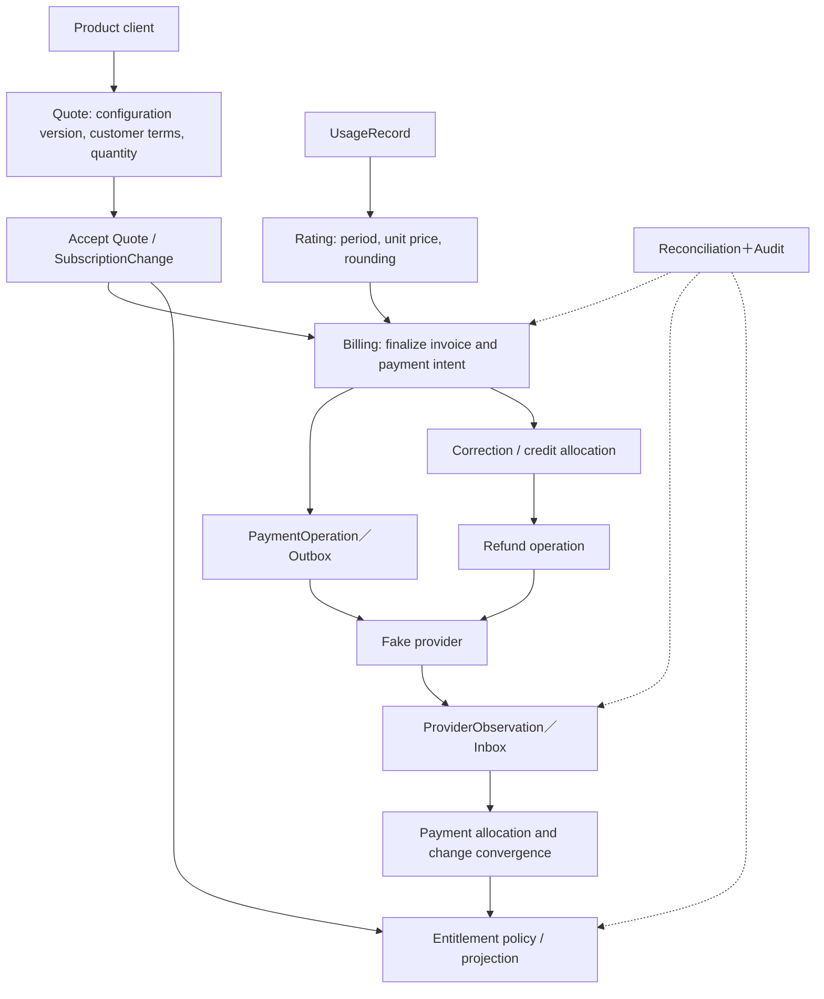

# Billforge: Research Synthesis, MVP Proposal, and Conceptual Plan

**English** | [繁體中文](commerce-lab-plan.zh-TW.md) | [简体中文](commerce-lab-plan.zh-CN.md)

Dated 2026-09-26; status updated 2026-09-28. **A–D are design exercises. Local implementations exist for E, F1–F8, and P01–P03. Web Admin actions C01–C49 are wired, with full acceptance still in progress. The overall MVP has not been validated for production. Consult the completion tracker and implementation records for remaining acceptance work.**

This plan combines the supplied commerce backend role requirements, the initial correctness MVP, the later senior engineering scope, and 34 open-source investigations. The research uses public code and documentation. A–D define policies, boundaries, and scenarios; E, F1–F8, and P01–P03 provide local lab implementations. The investigated projects do not need to be deployed.

The [design index](design/README.md) contains the A–D work: pricing policy, facts and states, 12 failure scenarios, reconciliation and repair, API contracts, and price migration. The [MVP completion tracker](implementation/mvp-completion-tracker.md) distinguishes design decisions from implemented and verified paths.

## 1. Recommendation and current evidence

Build the **Billforge Commerce Correctness Lab** with Go, SQLite, one executable, and a controllable `FakePaymentProvider`. A bounded set of pricing components covers the commerce lifecycle. The goal is to change plans safely while explaining each amount, service activation, and repair.

The workspace contains local implementations of E, F1–F8, and P01–P03, listed in the [MVP completion tracker](implementation/mvp-completion-tracker.md). The 34 investigations supply comparable design concepts; the local implementations alone do not establish complete financial guarantees. Treat the green, yellow, and red capability table as planned coverage, not as a rating of people or production maturity.

The [interactive CLI](implementation/interactive-cli.md) operates and inspects local flows. The [loopback v1 API](implementation/phase-p2-v1-api.md) and [account boundary migration exercise](implementation/phase-p3-account-cutover.md) provide additional local evidence. A public API, complete authorization model, and production operations still need separate design and verification.

| Source | Constraint on the plan |
| --- | --- |
| Initial MVP requirements | Money, history, idempotency, UNKNOWN outcomes, failure handling, reconciliation, and entitlements are core. Use Go and SQLite before adding more infrastructure. |
| Expanded scope | Add renewals, plan changes, proration, billing close, Net30 contracts, grandfathering, API compatibility, and migration. |
| Commerce platform role requirements | Address pricing and packaging speed, platform adoption, revenue accuracy, operations, performance, and cross-team trade-offs. |
| 34 open-source investigations | Use design ideas for pricing, obligations, payment operations, entitlements, and corrections; do not assume any project’s operating guarantees transfer to this lab. |

The lab can demonstrate architectural judgment, explainable troubleshooting, and evidence for API evolution. Real-scale operations, cross-team leadership outcomes, conversion improvements, and ARR impact require separate evidence from actual work.

## 2. Research comprehension: which concepts should be included in the programme

|Common concepts|The study provides clues.|Billforge's suggestions|
| --- | --- | --- |
|The pricing configuration is versioned, subscriptions are directed.| OpenMeter、Kill Bill、Lotus、Meteroid |V2 releases without changing existing customers; The price version, the client designation and migration are separated.  |
|There's a clear distinction between financial and preview facts.| Magento、Shopware、Oscar、Medusa、Flexprice |Quote records the context, validity period and version; A long-term intention after acceptance; The invoice confirms the amount of consolidation.  |
|It's not the same thing as a single vote.| Lago、OpenMeter、Portcall、Kimai、Tryton |Usage Preserving facts; Rating Preserves the computational basis; Invoice to save verified results.  |
|Goldflow's intentions and external observation are separated.| Kill Bill、Hyperswitch、Saleor、Active Merchant |Operation, Attempt, ProviderObservation are all different. Unknown needs to be verified.  |
|It is important to note that there is a difference in the amount of credit and refunds.| Solidus、Lago、Bigcapital、ERPNext、Formance |Adjustment/CreditNote、CreditAllocation、Refund retains the source chain and common limitations.  |
|The service entitlement has its own policy.| Kill Bill、OpenMeter、Odoo、Dolibarr |Debt, terms of contract and term limits together determine entitlement, and the status of payment cannot directly replace entitlement.  |
|Expanded interfaces still require versions and operating policies.| WooCommerce、Vendure、Sylius、Bagisto、Cashier |Stable API, single write responsibilities, cache failures, old client behavior and security rollout design.  |

** Disagreements in the study must become explicit policy. ** For example, there is no general answer on whether to delay the consumption calculation to the current period or to retrospectively correct, whether to refund credit for unpaid invoices, whether to automatically change prices affect old subscriptions. The following section presents a set of flaws that are appropriate for the lab, preserving the reasons and consequences for the change.

## 3. Limited scope of business and recommendations

The following are working assumptions, not describing them as user-approved policies.

|Projects|It is recommended to avoid|It's an intentional restriction.|
| --- | --- | --- |
|Products and Programs|It's a product of automation. Basic Pro is the solution. Basic $20 a month; Pro $50+$10 x Seat/month  |Pro's seat quantity is the total paid seats and does not imply free seats; In general, subscribe to at least one seat.  |
|The price of components| FixedCharge、PerSeatCharge、IncludedQuantity、UsageOverage。  |PriceDefinition is a value object within the version; Do not do any DSL, promotional engine or all tier modes.  |
|The time of the billing.|Fixed fee/seat advance payment; Payment after dose. USD, UTC monthly cycles, intervals are [start, end]  |Preserving the original lunar spot; In the last few months, we've reached the end of the month, and we're back to the starting point next January.  |
|How much?|The next version of the Pro included 20,000 tasks per session, an excess of $0.001/task.  |Included quantity is the quoted allowance, which is not the hard quota for stopping service.  |
|New purchase and renewal|Opening of new purchases after confirmation of payment; There is a seven-day service limit after the extension.  |Invoice due date, retry scheduling, grace deadline are saved separately. The limit can be configured and there is a policy version.  |
|Changes in the general scheme|The up/down can be ranked at the bottom; In the meantime, we're going to do another round of immediate upgrades.  |The first phase does not support repeated retrospective changes on the same day; It is the only way to prevent conflicts using version precondition.  |
| Proration |The ratio is calculated as the actual number of seconds remaining in UTC/full-period seconds, with the exact middle value remaining and then in a linear manner.  |Separation of sample formulas and policy on service effectiveness; Payment delays beyond the point of entry into force still need to be completed.  |
|Cancellation and Restoration|Cancellation of the support period and cancellation before the end.  |During the period of re-purchase and creation of new services after completion; It's not automatically deleting history.  |
|The price of old customers.|The new prices will only affect the new prices; It is the first of its kind in the world, and it is the first in the world.  |The current price is not used to re-interpret historical transactions.  |
|Corporate contracts|Acme: $40+$7 × seats, Net30, contract version with valid intervals; The service has not yet expired and can be activated.  |but only a rewrite of a contract, Changes/expirations align the billing period boundaries, require clear post-expiration appointments, and lack timed manual processing.  |
| Billing close |Fixed input termination number/time and rating revision; Subsequent differences in late-to-dose after approval.  |The correct difference is to place an invoice and the original service period; The negative gap is corrected; No rewriting of the validated invoice.  |
|The amount|The total amount of transactions is 100 cents. Single-price/intermediate calculations with precise decimal places or rational numbers.  |Each "accounting component x service area" is then aggregated into cents, taking half-even; The rules will also be edited.  |
|Payment|A FakePayment Provider that can be searched for and supports stable operation keys.  |In the beginning, only direct capture/refunds were made; Authorized recapture remains as a model extension.  |

Tax, multi-currency, global merchant-of-record, full ERP, general accounts and real Stripe integration are not included in this MVP. Revenue Recognition maintains architectural interfaces and source events; In fact, invoices, receipts and revenue generated are not the same thing.

**Mid-stage upgrades to meet UNKNOWN are the first policy launches that must be completed. ** Recommends that effective schemes be upgraded only after confirmation of mainstream acceptance of payments; However, the effective time of the quote cannot be exactly the same during the pretended period if it is earlier than the actual opening time. The proposal must choose policies such as "re-offer and process old payments" or "retain the original price, instead of delay service compensation" and prohibit any subsequent silent price changes. This combination will not be immediately upgraded to full acceptance until the situation is resolved.

## 4. Model and fact ownership in the smallest domain

Each row is a logical module, not a standalone service; Each name does not necessarily correspond to a data table. The first thing that needs to be done is to recognize the identity and the facts from the scene, so that the value objects can be embedded. Intermodules are coordinated by application workflow to command/find exchange data.

|Modules|The smallest object.|Who is responsible for the facts and circumstances?|
| --- | --- | --- |
| Account reference | Customer、BillingAccountRef、BeneficiaryRef |Customers, payers and service users have a stable ID, respectively. Lab can make them one by one, but not move account authentication data into Commerce.  |
| Catalog／Pricing | Product、Plan、PriceVersion、PriceDefinition、Quote |the price configuration has been published and cannot be altered; Quote is a fixed-term calculation of snapshots, save versions, quantity, terms and expected current/future charges.  |
| Subscription／Terms | Subscription、SubscriptionChange、SubscriptionPricingAssignment、CustomerContractVersion |Separate business intentions, effective schemes, changes during and in the future of service; Refer to the price and entitlement version of the policy.  |
| Measurement／Billing | UsageRecord、UsageAssignment、RatingResult、BillingRun、Invoice、InvoiceLine |The original use cannot be rewritten; the rating may be revised; The source, precision and amount of the finalized line cannot be rewritten.  |
| Receivables／Corrections | Adjustment／CreditNote、CreditMovement、Allocation |Preserving the source and use of corrections, payment allocations and credit; The remainder is for rebuilding projections. This is a limited set of records that should not be declared as a complete accounting statement.  |
| Payments | PaymentIntent、PaymentOperation、PaymentAttempt、ProviderObservation、Refund |Intent is an obligation to pay; Operation is an external economic effect; Attempt is a transmission; Observation is an observation with a source.  |
| Entitlements | EntitlementPolicyVersion、EntitlementProjection |entitlement is derived from a valid subscription, contract, payment/debit and time policy, recording the reasons and source version of use.  |
| Operations | ReconciliationRun、Discrepancy、RepairOperation、AuditEvent、Inbox／Outbox |Preserving gaps, evidence, classification, repair and verification; It is not possible to circumvent the limitations of the field with a repair program.  |

PriceVersion's purchase period is not the same as "old subscription automatically changes". ContractOverride only rewrites explicitly permitted fields, analyzes the existing pricing assignment, and sets up valid contracts; The lack of prices, overlapping validity, unknown components are all clearly rejected.

Subscribe to Status of non-mixing all concepts:

- Business lifecycle: pending, active, ended; Cancel_at and scheduled changes.
- Receipts/debit: current, open, past_due, as determined by invoice and due date.
- PaymentOperation：created、submitted、pending／unknown、succeeded、definitively_failed。
- Benefits: active, grace, suspended, expired; the source and effective period are checkable.

Thus, "Requiring Pro, the valid scheme is still Basic, invoice open, payment unknown, Basic entitlement active" is an interpretable middle state. Net30 can legally appear as "Valid Pro, Invoice Open, Not Received, Pro entitlement active".

## 5. Processes and atomic boundaries

Quote is not equal to invoice. Quote: "Now we should get $100; the future fixed at $100/period; "Excess fees paid after actual use" cannot be included in the total monthly price promised for unknown future consumption.

|The border.|It's the same thing in the local trade.|In addition, the report also highlighted the importance of trade-offs and recovery.|
| --- | --- | --- |
|Accept the quote|Verify the validity, customer/subscription version and fingerprint; Create change intent, operation identity, audit.  |If the version has been changed, return clear conflicts and re-offer; If it is successfully accepted, retry returns the same result.  |
|Invoice verified|Lock/version checks, fixed input sets, line snapshots, validation numbers and associated unique keys.  |Only the submitted outbox is published; I can't half approve, half change the new price.  |
|Payments are made.|Keep the operation and dispatch of fixed amount/currency/provider key.  |Provider calls are not included in local DB transactions; Time mark unknown and find the original operation.  |
|The return on consumption|Inbox to weigh, verify and observe applicability, update operation/allocation, write audit/ follow-up work.  |The old events do not cover the new truths; No available cause-and-effect timing for the provider, not just the time of the event.  |
|Refunds/credit use|Reservation or deduction of quotas for the same source, preservation of refund intent, unique identity and work.  |UNKNOWN maintaining the budget; Confirmation of success is completed, and confirmation of no external effects is released.  |
|Updated entitlement|Project and save source revision based on submitted sources and policy version.  |The same result can be obtained by running again; Midway crashes can be supplemented by outbox or reconciliation.  |

In the future, if a fake provider is implemented, let it use a** standalone durable status/independent transaction**, such as a second SQLite file in the same program. Otherwise, putting the provider and Commerce in the same transaction would cover up the core of "remote success, local failure".

Retrievers need different stability identities. The API request key and the Economic Effect key cannot be confused:

|Operations|It is also important to understand the role and identity of the person.|
| --- | --- |
| Subscribe／ChangeSubscription |billing account+client+request key, and another with accepted quote ID to prevent the same acceptance action from being replicated key.  |
| Generate invoice |The subscription+service period+charge group's original opening obligation; I can't change my body. After verification, the correction uses an additional correction ID.  |
| Charge | provider account＋PaymentOperation ID； The amount/currency is fixed. The replacement operation must first demonstrate that the previous operation had no external effects and check the remaining receivable amount of the obligation.  |
| Process webhook | provider account＋event ID； Different events point to the same operation and can only produce one corresponding financial effect.  |
| ReportUsage |Tenant+source+event ID, with a fingerprint attached to the content; Changing the timestamp does not create a new re-transfer identity.  |
| Refund |The original capture+refund business operation ID; All attempts use the same provider key and share a refundable retention mechanism.  |
| Repair | discrepancy＋action＋source revision； The source changes are first reclassified, without the use of invalid pre-arranged repair conditions.  |

## 6. First edition Conditions not to be violated

| ID |The conditions are unchanged.|The evidence should be seen.|
| --- | --- | --- |
| I01 |Invoice.Total is equal to the sum of the validated InvoiceLine.Amount; It's not the same.  |In addition, the Commission's proposal for a regulation on the implementation of the regulation was adopted by the Commission.  |
| I02 |The unit price and the rating intermediate can be accurately represented; The decision not to use binary float should be taken.  |The original quantity, precision, value and final cents.  |
| I03 |The prices and the validated amounts have been published/cited and have not been modified.  |Immutable version, original line snapshot, new corrected records.  |
| I04 |Each promised fee can refer to pricing assignment, contract/policy and service duration.  |The whole provenance.  |
| I05 |Effective pricing assignments for the same customer and service range do not result in undefined overlap.  |Effective differentiation between migration and decision-making.  |
| I06 |Accept the Quote using the verified above context; The payment amount sent is not recalculated by the current price.  | quote fingerprint、subscription revision、operation payload hash。  |
| I07 |The same operation retry cannot be captured repeatedly; The receivables and indexes of the same obligation shall not exceed the authorized receivables.  |Obligatory identity, operation key, receipt reservation, provider search and allocation.  |
| I08 |The result is returned with the idempotency key and the payload. Key and payload are clearly in conflict.  |Lasting key range, payload hash, original results.  |
| I09 |UNKNOWN/PENDING does not mean that there is no external effect, nor can a second receipt be placed directly.  |Non-final status and follow-up observations.  |
| I10 |Webhook's repeat or disorder does not produce a second financial effect, nor does it confirm a successful withdrawal.  |Inbox event ID, operation revision, observing conflict records.  |
| I11 |The identity of the same source event cannot represent the fact that there are two sets of dosages; Re-shipping does not increase the costs.  | tenant＋source＋event ID、payload fingerprint。  |
| I12 |For every thing there is a definite term. Re-reading events as a difference can be calculated, and not repeatedly collecting the same economic effect.  |Usage Assignment, rating revision, accounting for the accounting gap.  |
| I13 |Billing closure changes do not change the original validated invoice.  |The original invoice and the subsequent debit/credit source chain.  |
| I14 |The amount of refund + not yet determined shall not exceed the capture which can be refunded.  |Reservation of the same payment and successful refund.  |
| I15 |The amount of credit used, refunded and retained does not exceed the grant from the source.  |Distribution/release records; The same credit cannot be debited and cash withdrawn at the same time.  |
| I16 |Amendments to unpaid receivables to form cash withdrawal.  |Source of funds for the original invoice, paid/unpaid portion, credit.  |
| I17 |entitlement changes can be derived from the source facts, policy versions and clock interpretations; It's not equal to the paid bullet.  | entitlement reason、effective interval、source revision。  |
| I18 |Submission of important local transfers and their audit/deployment work atoms.  | transaction boundary、outbox； External operations have other recovery paths.  |
| I19 |Discrepancy keeps the expected, actual, source, observation time and classification, and cannot simply overwrite the error values.  | reconciliation evidence bundle。  |
| I20 |Repair has a stable identity, running preconditions and post-verification, and overrunning can't cause a repeat effect.  |Repair revision, idempotency key, verified results.  |
| I21 |The payment has been confirmed to be successful and the accounts, changes and entitlements are finally matched when the worker/seeker finds them available and policy permits.  |Repeat the work and alert the police; When it is not possible to obtain external truths, it is allowed to be handled manually, and false claims must be automatically enclosed.  |

These conditions are the design requirements of Billforge. The name of the field, lock, or state in the study provides only clues, and does not prove these conditions for us.

## 7. Avoid covering up policies with beautiful models by using numbers.

** Monthly fees and usage. ** Pro's fixed five-seat fee is $50+$10 × 5=$100. Using 53,241 tasks, an excess of 33,241 × $0.001 = $33.241, the usage line is $33.24 according to the rules of this program. If the ticket is opened with a fixed fee, the total is $133.24; If the votes are opened separately, they should be able to correspond to the same service period.

**Proration。 ** Service period [2026-09-01 00:00Z, 2026-10-01 00:00Z], increased from Basic to five Pro seats at 09-16 00:00Z: remaining ratio 15/30, with no Basic down payment -$10, +$50 during the remainder of Pro, net receipts of $40. The $15 exemption for basic needs only compares the basic fee of $20 to $50 and does not include seats; The full quote cannot miss a seat. Keeping two sources of computation, not just keeping the net amount.

In this case, it is recommended to express two signed lines in a separate supplementary difference invoice with the original Basic invoice unchanged. -$10 has been offset in the document +$50, and no more $10 credits can be used. If the amendment determines the cancellation, the entire compensation obligation shall also be retractable withdrawal/correction; Unknown can't be cancelled. The compensation policy for delayed service is still subject to approval by S07.

** Late for the dose** ** The original price was 53,244 tasks: $33.244 → $33.24 After closing the account, the cumulative value of the four tasks over the same period was $33,248 → $33.25, the difference being $0.01. If you count to four, $0.004 will be $0.00 for $0.00. The adjustment should be based on the "accumulated receivables under the same original policy - the amount entered in the accounts" to avoid refunding the included quantity or the batch-by-batch loss amount.

**Credit and refunds** ** Original invoice $100, correction - $20:

|It's not easy.|Repaired and repaired|This is the only way we can do this.|
| --- | --- | --- |
|It is not yet received.|The remainder is $80, with no cash source credit.  |The fee is $80.  |
|I got $60.|The remaining $20 must be collected, and $20 cannot be withdrawn.  |The fee is $20.  |
|I received $100.|The amount of the original invoice is unchanged; Net liability $80, $20 from the original payment allocation issued as source credit.  |$20 for future accounts or refunds; It's a shared amount, you can't do both.  |

Release of the distribution in a new reverse/re-classification record expression with the original distribution remaining. If the result of a refund of $20 is unknown, then this $20 is taken first; I can't take it with me to pay another invoice at the same time. It's the limited subledger language that MVP must have.

**Net30。 ** Acme's five-seat contract costs $40+$7 x 5 = $75 09-01 Confirmation, 10-01 expires, service is effective as of September; The receipt has not yet been made as a valid reason for the suspension of entitlement. Whether the limitation is after expiration is subject to contract policy, not according to "new purchases must be paid first".

## 8. Twelve business and three staff presentations

Fixed records for each round: initial facts → command → local submission points → external observation → interruption points → unchanged conditions to be maintained → recovery/artificial decision making → results seen by customers and financials. Use false clocks and clear events to avoid "waiting should be fine".

|The number|The situation.|The answer to the question is to complete the presentation.|
| --- | --- | --- |
| S01 |New Basic subscription|When did quote, invoice, capture, activation, entitlement become a reality?  |
| S02 |Regular monthly renewal|How to prevent duplication of billing/invoicing? How do you deal with the end of the moon and the long of the moon?  |
| S03 | Renewal fails → grace period → suspended → catch-up payment | Which policies govern outstanding amounts, entitlements, and whether invoices continue to be issued for later periods? |
| S04 |Provider success but lost response locally|Why the Unknown? How to check the original operation and avoid changing the key and deducting it?  |
| S05 |Repeat/delay/disorder webhook and crash before entitlement after receipt|What results can be reconstructed from the facts that have been submitted? How do you deal with older observations?  |
| S06 |After the end of the period, the resumes are cancelled.|What is the priority order of scheduling conflicts, version checks and cancel_at?  |
| S07 |In the middle of the period, instant upgrade + proration.|How are deductions and new fees expressed? Payment unknown How to compensate/re-offer when it crosses the effective point?  |
| S08 |Pro v1 → v2, old client left v1, only migrated cohort A|How to preview migration, identify the customer, complete and stop part of it?  |
| S09 |Before and after check-in, re-shipping, content conflict and late arrivals.|This is the last time the event has been rescheduled. How do you deal with differences, allowances, repetitive corrections?  |
| S10 |Acme has written a contract over to +Net30+ expires.|How do you deal with price priority sequence, entitlement and expired assignment absence?  |
| S11 |Repair of unpaid/partly paid/full-paid invoices and concurrent refunds|How to avoid double interest in receiving corrections, credit sources, and withholding refunds?  |
| S12 |It's a lot of money, and it's a lot of money, and it's a lot of money.|What can be repaired, what can be verified, what can be worked on? How do you keep the evidence for repair and post-testing?  |
| P01 |Product requests to launch AI tokens SKU within 3 days|Can it be done with existing components, new meter/unit/price version? Which core modules need to be changed and why?  |
| P02 |Both consumer and old API clients are continuing to work.|When new components, contract terms and usage fees appear, do the old clients still understand and accept prices?  |
| P03 |Mature single account/Commerce border migration + grey change in price|How to introduce adapter, shadow comparison, backfill and single write responsibilities; How to stop it from spreading when it fails?  |

The three days of P01 are the time limit for future delivery, not the ability of the wheel to measure. P02 can't just check JSON, but it can still be resolved: adding unreported fees, even if the API schema is compatible, could violate commercial commitments.

Failure dimensions include at least Success, Definitive Failure, TimeoutBeforeCommit, TimeoutAfterCommit, DuplicateWebhook, DelayedWebhook, OutOfOrderWebhook, ProviderUnavailable. Then insert the process crash into the local intent, submit before, submit provider, submit observation, submit and update entitlement; Only change the location of the failure and the final amount of the same business operation should be consistent.

## 9. Reconciliation judgment and operation

The scope of verification includes provider payment, local payment, payment allocation, invoice, subscription/contract, entitlement, usage, rated/billed usage, local refund, provider refund, and credit grant, allocation/reservation. the comparison should be made with the observation time during the service; Temporary delay and determination of differences should be separated.

|I found it.|It is recommended to classify.|Action and Borders|
| --- | --- | --- |
|Payment/valid subscription facts are complete, only entitlement projections are missing| SAFE_AUTO_REPAIR |Restore, preserve and restore the previous and subsequent values and source revisions according to the selected policy.  |
|Outbox has been submitted undelivered, no new economic operation is necessary| RETRY_REQUIRED |the same job status; Don't re-create payment by the way.  |
|Provider request timeout, no proof of termination| EXTERNAL_LOOKUP_REQUIRED |Check the source operation/provider reference; It's not like it happened.  |
|Provider shows success, but the amount/coin varies, or local intent is not found.| MANUAL_REVIEW |preserving the original observation; Freeze further automated gold flows, cannot automatically change invoices to level.  |
|Historical financial facts are missing/contradictory and cannot determine the correct source.| UNSAFE_TO_REPAIR |Providing evidence and making artificial decisions; It was rebuilt without overwriting the original data.  |

Each repair will save the discrepancy ID, the source revision, the policy version, the actor/reason, the operation key, the run result and the new verification results. The source has changed in terms of reclassification when running. Manual review is a managed end, and there should be a responsible person, a reason, waiting time and the next step; It's not a line that will disappear forever.

The joint audit at least keeps the entity ID, event type, state, reason, actor, source, time of occurrence/receipt and correlation ID; In the case of reconciliation, the expected, actual, evidence, classification, repair action/result is left. The historical amount must be distinguished from the projections of the state that can be updated.

Support staff can at least check: "Why this amount is being charged", "Why Pro is now available", "Where the refund card is observed", "Whether the repair will generate another gold rush". Operating View can only be reported using CLI/JSON.

## 10. Platform API, price rollout and the production line

The minimum consumer contracts are Quote, Subscribe, ChangeSubscription, ReportUsage, GetEntitlements; There is also an internal migration preview/apply、reconcile/repair input. Consumers provide usage, schemes, seats and usage The fact is, they don't calculate base+seats+overage themselves.

Quote responses must include charge_now, known recurring components, unknown future usage charges, currency, expiration, pricing/contract/policy version, subscription precondition. When accepting quote ID and idempotency key. Conflict between different types of content; Idempotent can't rely solely on short-term HTTP caches.

The price rollout process suggested:

1. Draft Configuration → Structural and quantitative policy checks → New and old quotes compared with fixed scenarios.
2. Create a clear cohort assignment, enterprise contract and do not automatically join the experiment.
3. If the old client is unable to display/accept the new charge component, the compatible version can be retained or explicitly rejected, and cannot be confused by adding an optional field.
4. Preview which new purchases/renewals are affected, first a small cohort, then an expansion; migration Each client has a stable operational identity.
5. Stop the rollout only to prevent new assignments/new operations; It has promised to keep prices, invoices and capture, and to compensate and correct the wrong effects.

The development of the mature unit was preceded by the Account adapter and the stable BillingAccountRef, allowing the new old read model to make a shadow comparison. Each type of financial effect of the switching process retains only one writer; Dual writing is not a solution to the lack of consistency.

Go+SQLite is enough to carry the logic of the lab; It cannot prove the behaviour of multiple production writers. In the future, if there is a clear need to reassess:

- Multi-writer/lock competition: re-validation of the original unchanged conditions with a database with appropriate transactional capacity.
- Measurement ingestion/aggregation, but retaining the traceability of event identity and billing input.
- Long-term retry and cross-service processes: Introducing a workflow engine or queue to retain the original operation identity.
- entitlement reading delay: discuss cache and define version failure first, allowing for obsolete time and reconstruction methods.

## Phase 11 Planning and Progress

The products are subject to review and approval at each stage; Progress is not determined by how many entities or endpoints are written.

Currently, the AD documentation, EFFF8 and P01–P03 have corresponding records; The Web Admin is connected to C01 and C49, and full acceptance is ongoing. The latest scope, evidence and unfinished business see [MVP completes tracking](implementation/mvp-completion-tracker.md), [Web Admin is implemented](implementation/web-admin.md) and [The following is a summary of the results of the survey:](implementation/web-admin-action-audit.md).

|Stages|The product|By condition.|
| --- | --- | --- |
|A: Policy and vocabulary|The program's decision-making table, number of instances, classification of problems.|The policy of cycle, grace, late use, proration/UNKNOWN, credit/refund is not contradictory.  |
|B: Models and states|Entity ownership, source/projection tables, state diagrams, and 21 unchanged conditions.|S01, S04, S10, S11 can write data changes step by step without using status or mysterious balance.  |
| C: Failures and repair | Traces for 12 scenarios, a failure matrix, and a reconciliation matrix | Every crash or retry point has an identifiable result and a clear point where verification or a human decision is required. |
|D: The platform evolves.|The two consumer contracts, v1/v2 compatibility, migration/rollout ADR|P01 - P03 can describe configuration changes, process changes, explosive radius and response.  |
|E: Minimum capable of running core (continuous)|Go+SQLite, persistent fake provider, controllable clock/interruption point|S01+S04+S05: A single receipt can be restored after unknown, and crash does not cause a second effect.  |
|F: Growth expansion (follow-up)|Renewal/repair → Discount of use → Contract/Migration → Platform compatibility|For each additional set of situations, the original scene and amount of oracle remain; The model has problems that can be changed.  |

The following is the context in which AF maintains the original actual route; Currently, the status of AD, EF1F8, P01–P03 is ready to complete the tracking. Future additions should be subject to fixed policies and acceptance conditions, and re-evaluation of the working period, and cannot be completed within a fixed number of days by assuming that any function already in place can be cut.

Each ADR has fixed answers: which invariant to protect, which changes to support, what complexity to add, whether to reverse, how partial failures will be detected and fixed, which customers to affect. Adding a component should be able to point to the scenarios it serves.

## 12. Acceptance of evidence, J.D. Conversation and knowledge gaps

| Role capability | Evidence the lab can produce | Experience still needed beyond the lab |
| --- | --- | --- |
|Pricing and packaging are evolving rapidly.|P01 New SKU, S08 price indication, modification module and step record.  |The real team's launch time and commercial impact.  |
|Financial accuracy/operation|I01  I21  S04/S09/S11/S12  Explain audit and repair  |Real providers, accounting/tax, on-call and accident experience.  |
|API/platform and developer experience|Two consumer, P02, old client behaviour, documentation and mismatch.  |Acceptance, support and long-term compatibility of governance across teams.  |
|The evolution of mature systems.|P03 adapter/shadow/single writer migration, phase ADR  |Collaboration of large historical codebases with actual migration.  |
|Performance and Points|In future fixed data sets and machines, we measure quote/entitlement p50 p95, shutdown time, fix waiting time.  |Production load, conversion rate, retention and ARR; The lab didn't invent these results.  |
|It's a team-to-team exchange.|Review the same situation from the perspective of Product, Finance, Sales, Support, and record conflicts and decisions.  |True coordination, mentors and organizational influence.  |
| AI judgment | AI can draft models and templates; policies, monetary oracles, UNKNOWN outcomes, and repair permissions require independent review. | Turn those judgments into everyday engineering practice across the team. |

First record the baseline and talk about improvements, without missing the fictional p95 or swallowing the SLO. It can be accepted with certainty: retry does not add a gold flow effect, historical invoice amounts remain unchanged, old clients will not be accidentally charged for new charges, each correction is sourced.

Knowledge gaps continue to be classified as Vocabulary, SaaS billing domain, architecture, distributed systems, financial correctness, operational experience. Each recording of "original assumptions, proofs, changes in decisions, what's still missing" avoids mistaking unfamiliar nouns for incompetence and replaces accounting policies with distributed systemic knowledge.

## 13. Direct agenda for the next launch

First move **S01 → S04 → S07 → S11**: From Basic first payment, to Pro upgrade, remote success but lost response, then make corrections and refunds. It simultaneously pushes the boundaries of quote, subscription change, invoice, payment identity, entitlement and credit.

First, write down the six decisions into specific trace: first/renewed opening policy, time grain and time for proration, UNKNOWN service reimbursement across the point of effect, credit allocation for unpaid invoices, pending refunds, maintenance of automatically operational prerequisites. Each candidate lists what customers get, what companies should receive, what evidence they leave behind, and then chooses the policy.

Then go S09 and S10, check if the same model can handle late-to-volume and Net30, without relying on the client name exception; Finally, use P01 and P03 to check the platform boundaries. This sequence can quickly reveal where the model needs to be changed.

## Appendix: How the survey is used

The table below is a study index, not a ranking. Similar conclusions from similar projects have not been independently verified multiple times.

|Problem groups|This is a case-by-case report and a perspective on the implementation of the programme.|
| --- | --- |
|Subscriptions/Pricing/Measurements|Lago, Kill Bill, OpenMeter, Flexprice, Polar, Meteroid, Lotus, Portcall: edition, designation, deadline of use, entitlement and verification boundary.  |
|Quote/Orders/Configuration| Magento、Solidus、Saleor、Vendure、Medusa、Sylius、WooCommerce、Shopware、PrestaShop、Django Oscar、Spree、BagistoThe following are available: preview, submit, snapshot, extensible API and after-sales corrections.  |
|Corporate/debit/funding records|ERPNext, FOSSBilling, Dolibarr, Tryton, Apache OFBiz, Odoo Community, Bigcapital, Formance Ledger, InvoicePlane, Kimai: terms and conditions, service chain, credit rating, source and number of limits.  |
|Provider/External Projection|Hyperswitch, dj-stripe, Laravel Cashier Stripe, Active Merchant: operating identity, asymmetrical observation, UNKNOWN/pending, adapter and local projection.  |
