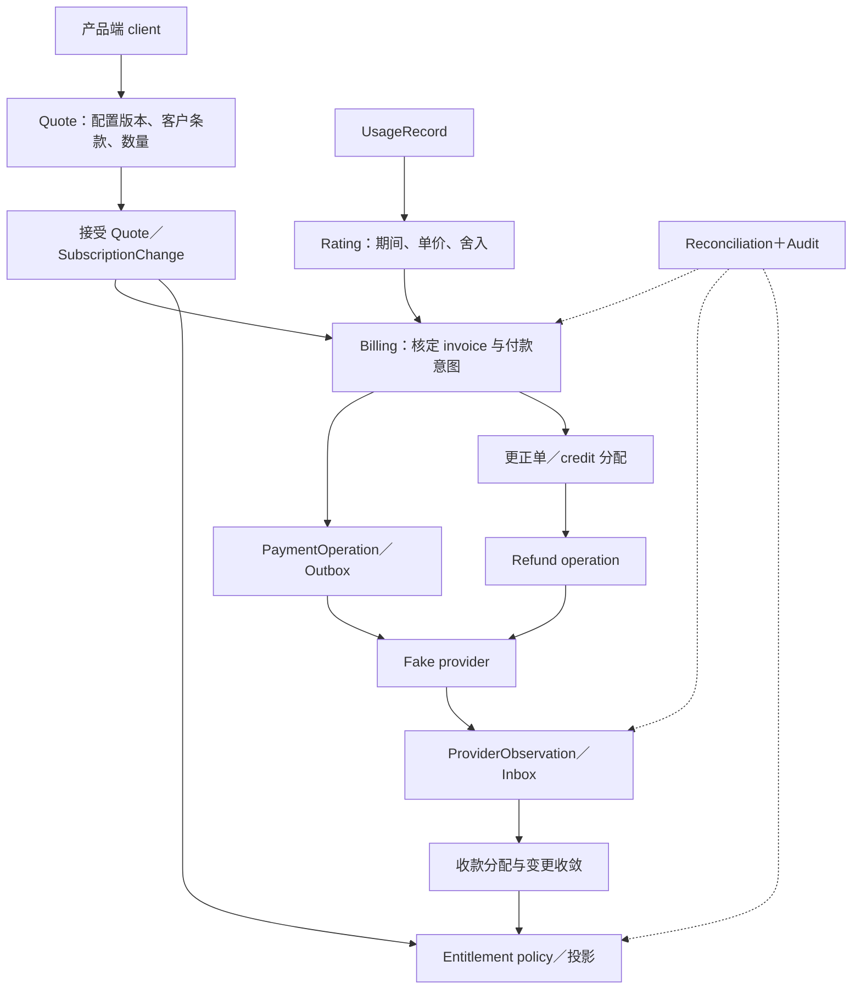

# Billforge：研究综合、MVP 方案与概念推演计划

[English](commerce-lab-plan.md) | [繁體中文](commerce-lab-plan.zh-TW.md) | **简体中文**

日期：2026-09-26；状态更新：2026-09-28。**A–D 为设计推演；E、F1–F8、P01–P03 已有本机切片，Web Admin C01–C49 已接线、完整验收进行中。整体 MVP 尚未经生产验证，各项完成条件与未完成矩阵以完成追踪及实作纪录为准。**

本方案集成用户提供的商务平台后端职务需求、第一份 correctness MVP 需求、第二份资深工程范围补充，以及 34 份开源调查。研究限于公开程序与文档；A–D 选择政策、画清边界并推演情境，E、F1–F8 与 P01–P03 已创建自己的本机 lab 切片。不需要部署任何被调查的项目。

A–D 的具体推演已整理于 [设计文档索引](design/README.zh-CN.md)：计价政策、事实与状态、12 个故障情境、对帐修复，以及 API 与价格迁移契约。设计仍用来界定规则；哪些路径已有实作与证据，另依 [MVP 完成追踪](implementation/mvp-completion-tracker.zh-CN.md)判断，不把整份设计等同完整实作。

## 1. 建议方向与目前掌握的证据

建议创建 **Billforge Commerce Correctness Lab**：维持 Go、SQLite、单一程序与可控制的 FakePaymentProvider，用有限的定价组件覆盖完整的商务生命周期。内核能力是让产品团队能安全变更方案，并能解释每笔金额、每次服务开通与每项修复。

工作区已依 [MVP 完成追踪](implementation/mvp-completion-tracker.zh-CN.md)创建 E、F1–F8 与 P01–P03 的本机切片。34 份调查提供可比较的概念和来源；这些切片不能据此宣称 Billforge 已具有完整金融保证。原需求中的绿／黄／红能力表亦应读作「计划覆盖面」，不是用户能力或系统成熟度的评分。

[交互式菜单 CLI](implementation/interactive-cli.zh-CN.md)已能操作和查找上述本机切片；[loopback v1 API](implementation/phase-p2-v1-api.zh-CN.md)与[帐户边界迁移演练](implementation/phase-p3-account-cutover.zh-CN.md)提供本机操作证据。正式对外 API、完整授权与生产营运接口仍需独立设计与验证。

| 信息来源 | 对方案的约束 |
| --- | --- |
| 第一份 MVP 需求 | 金额、历史、幂等、UNKNOWN、failure handling、reconciliation、entitlement 是内核；Go＋SQLite，避免过早引入基础设施。 |
| 第二份范围补充 | 补齐续约、升降级、proration、billing close、Net30 合约、grandfathering、API 兼容性与迁移。 |
| 商务平台职务需求 | 同时重视 pricing／packaging 的交付速度、平台采用、营收准确性、营运、性能及跨团队取舍。 |
| 34 份研究 | 支持拆开价格配置、已承诺金额、支付操作、服务权益与更正；各项目的商业政策与运行保证不可直接移植。 |

这个 lab 可以产出架构判断、可解释的故障处理及 API 演进证据。真实规模的营运经验、跨团队领导成果、转换率或 ARR 改善，仍需要实际工作证据补足。

## 2. 研究综合：哪些概念应进入方案

| 共通概念 | 研究提供的线索 | Billforge 的建议 |
| --- | --- | --- |
| 价格配置有版本，既有订阅有指派 | OpenMeter、Kill Bill、Lotus、Meteroid | 发布 v2 不改既有客户；价格版本、客户指派与 migration 分开。 |
| 预览与财务事实有明确分界 | Magento、Shopware、Oscar、Medusa、Flexprice | Quote 记录上下文、有效期与版本；接受后形成持久 intent；invoice 核定固化金额。 |
| 用量、计价、开票分开 | Lago、OpenMeter、Portcall、Kimai、Tryton | Usage 保存事实；Rating 保存计算依据；Invoice 保存核定结果。 |
| 金流意图和外部观察分开 | Kill Bill、Hyperswitch、Saleor、Active Merchant | Operation、Attempt、ProviderObservation 各有身分；UNKNOWN 需要查证。 |
| 应收更正、信用额度和退款不同 | Solidus、Lago、Bigcapital、ERPNext、Formance | Adjustment／CreditNote、CreditAllocation、Refund 保留来源链及共同额度限制。 |
| 服务权益有自己的政策 | Kill Bill、OpenMeter、Odoo、Dolibarr | 欠款、合约条款与宽限期共同决定权益，付款状态不能直接代替权益。 |
| 可扩充接口仍需版本与营运政策 | WooCommerce、Vendure、Sylius、Bagisto、Cashier | 稳定 API、单一写入责任、缓存失效、旧 client 行为与安全 rollout 一起设计。 |

**研究中的分歧必须成为明文政策。** 例如晚到用量算本期还是回溯更正、未付 invoice 的 credit 是否可退款、改价是否自动影响旧订阅，都没有跨项目通用答案。下节提出一组适合 lab 的缺省，保留改动理由与后果。

## 3. 有界的业务范围与建议缺省

以下为工作假设，不把它们描述成用户已核准的政策。

| 项目 | 建议缺省 | 有意限制 |
| --- | --- | --- |
| 产品与方案 | 一个 Automation 产品；Basic、Pro 为方案。Basic $20／月；Pro $50＋$10 × 席次／月。 | Pro 的 seat quantity 是付费总席次，没有隐含免费席次；一般订阅至少一席。 |
| 定价组件 | FixedCharge、PerSeatCharge、IncludedQuantity、UsageOverage。 | PriceDefinition 作版本内的值对象；先不做任意 DSL、促销引擎或所有 tier 模式。 |
| 计费时间 | 固定费／席次预付；用量后付。USD、UTC 月周期，区间为 [start, end)。 | 保存原月日锚点；短月份截到月底，下一月回到原锚点。 |
| 用量 | Pro 后续版本含每期 20,000 tasks，超额 $0.001／task。 | included quantity 是计价 allowance，**不等于停止服务的 hard quota**。 |
| 新购与续约 | 自助新购付款确认后开通；续约逾期后有 7 天服务宽限。 | Invoice due date、重试调度、grace deadline 分别保存；宽限可配置且有政策版本。 |
| 一般方案变更 | 升／降级均可排到下期；另做一次期中立即升级推演。 | 第一期不支持同日多次回溯变更；用 version precondition 阻止冲突。 |
| Proration | 缺省以 UTC 实际剩余秒数／整期秒数计算比例，保留精确中间值再按行舍入。 | 比例公式与服务生效政策分开；付款延迟跨过生效点仍需完成下述推演。 |
| 取消与恢复 | 支持期末取消，以及结束前撤销取消。 | 结束后重新购买创建新服务期间；不自动抹掉取消历史。 |
| 旧客价格 | 指派钉选，发布新价只影响新指派；旧客通过明确 migration 更新。 | 不用 current price 重新解释历史交易。 |
| 企业合约 | Acme：$40＋$7 × 席次，Net30，合约版本有有效区间；尚未到期可先激活服务。 | 只做一种合约覆写；变更／到期对齐帐期边界，要求明确的到期后指派，缺少时转人工处理。 |
| Billing close | 固定输入截止序号／时间与 rating revision；核定后的晚到用量形成后续差额。 | 正差额放下一张帐单并标原服务期；负差额走更正单；不重写已核定 invoice。 |
| 金额 | 交易金额为整数 cents；单价／中间计算用精确十进位或有理数。 | 每个「计费组件 × 服务区段」先聚合再舍入至 cents，采 half-even；规则也要版本化。 |
| 支付 | 一个可查找、支持稳定 operation key 的 FakePaymentProvider。 | 初期只做直接 capture／refund；授权再 capture 留作模型扩充点。 |

Tax、多币别、全球 merchant-of-record、完整 ERP、通用总帐及真实 Stripe 集成不进入这个 MVP。Revenue Recognition 保留架构接口与来源事件说明；invoice、收款和实现收入不视为同一件事。

**期中升级遇到 UNKNOWN 是第一个必须完成的政策推演。** 建议主流程采付款确认后才提升有效方案；但 quote 的生效时间一旦早于实际开通时间，就不能假装期间完全相同。推演必须选定「重新报价并处理旧付款」或「保留原价、另给延迟服务补偿」等政策，禁止事后无声改价。这个组合情境未解决前，不将立即升级标成完整验收。

## 4. 最小领域模型与事实所有权

每一行是逻辑模块，不代表独立服务；每个名字也不强制对应一张数据表。先从场景辨识必须持久化的身分与事实，值对象可以内嵌。跨模块以命令／查找交换数据，由 application workflow 协调。

| 模块 | 最小对象 | 事实与状态由谁负责 |
| --- | --- | --- |
| Account reference | Customer、BillingAccountRef、BeneficiaryRef | 客户、付费主体、服务使用主体分别有稳定 ID；lab 可让它们一对一，但不把帐号认证数据搬进 Commerce。 |
| Catalog／Pricing | Product、Plan、PriceVersion、PriceDefinition、Quote | 已发布价格配置不可原地改；Quote 是有期限的计算快照，保存版本、数量、条款及预计现在／未来收费。 |
| Subscription／Terms | Subscription、SubscriptionChange、SubscriptionPricingAssignment、CustomerContractVersion | 商业意图、有效方案、服务期间和未来变更分开；指派同时参照价格与权益政策版本。 |
| Measurement／Billing | UsageRecord、UsageAssignment、RatingResult、BillingRun、Invoice、InvoiceLine | 原始用量不可改写；rating 可有新 revision；finalized line 的来源、精度与金额不可重写。 |
| Receivables／Corrections | Adjustment／CreditNote、CreditMovement、Allocation | 保存应收更正、付款分配、credit 的来源及使用；余额是可重建投影。这是有限应收纪录，不宣称完整会计总帐。 |
| Payments | PaymentIntent、PaymentOperation、PaymentAttempt、ProviderObservation、Refund | Intent 是欲支付的义务；Operation 是外部经济效果；Attempt 是一次传输；Observation 是带来源的观察。 |
| Entitlements | EntitlementPolicyVersion、EntitlementProjection | 权益由有效订阅、合约、付款／欠款及时间政策导出，记录原因和使用的来源版本。 |
| Operations | ReconciliationRun、Discrepancy、RepairOperation、AuditEvent、Inbox／Outbox | 保存缺口、证据、分类、修复与验证；不能以修复程序绕过领域限制。 |

PriceVersion 的可购买生效时间不等于「旧订阅自动变价」。ContractOverride 只覆写明确允许的字段，先解析既有 pricing assignment，再套有效合约；缺价、重叠有效期、未知组件均明确拒绝。

订阅不使用混合所有概念的万用 status：

- 商业生命周期：pending、active、ended；另存 cancel_at 与 scheduled changes。
- 收款／欠款：current、open、past_due，依具体 invoice 和 due date 判定。
- PaymentOperation：created、submitted、pending／unknown、succeeded、definitively_failed。
- 权益：active、grace、suspended、expired；来源和生效区间可查。

因此「要求 Pro、有效方案仍 Basic、invoice open、payment unknown、Basic 权益 active」是可解释的中间状态。Net30 则可合法出现「有效 Pro、invoice open、尚未收款、Pro 权益 active」。

## 5. 流程与原子边界

Quote 不等于 Invoice。Quote 可说「现在应收 $100；未来固定 $100／期；tasks 超额费按实际使用后付」，不能把未知的未来用量包成已承诺的月总价。

| 边界 | 同一个本地交易内的事 | 交易外的事与恢复方式 |
| --- | --- | --- |
| 接受 Quote | 检查有效期、客户／订阅版本与 fingerprint；创建 change intent、operation identity、audit。 | 若版本已变更，回明确冲突并重新报价；若已成功接受，重试回同一结果。 |
| Invoice 核定 | 锁／版本检查、固定 input set、line snapshots、核定号码及相关唯一键。 | 只发布已提交的 outbox；不能一半核定、一半改用新价格。 |
| 发出付款 | 保存固定 amount／currency／provider key 的 operation 和 dispatch 工作。 | Provider call 不包在本地 DB transaction 内；逾时记 unknown 并查找原操作。 |
| 消费回报 | Inbox 去重、验证观察适用性、更新 operation／allocation、写 audit／后续工作。 | 旧事件不覆盖较新真相；无可用因果顺序时查 provider，不只比事件时间。 |
| 退款／credit 使用 | 对同一来源额度保留或扣减，保存退款 intent、唯一身分及工作。 | UNKNOWN 保留预算；确认成功才完成，确认无外部效果才释放。 |
| 更新权益 | 根据已提交来源与 policy version 建投影，保存 source revision。 | 重跑可得到同一结果；中途崩溃可由 outbox 或 reconciliation 补上。 |

未来若实作 fake provider，让它使用**独立持久状态／独立交易**，例如同一程序中的第二个 SQLite 文件。否则将 provider 与 Commerce 放进同一 transaction，会掩盖「远程成功、本地失败」这个内核情境。

各种重试需要不同的稳定身分；API request key 和经济效果 key 不能混为一谈：

| 操作 | 建议身分与作用范围 |
| --- | --- |
| Subscribe／ChangeSubscription | billing account＋client＋request key，另以 accepted quote ID 防止同一接受动作换 key 重做。 |
| Generate invoice | subscription＋service period＋charge group 的原始开票义务；重跑不换身分。核定后的更正使用另外的 correction ID。 |
| Charge | provider account＋PaymentOperation ID；amount／currency 固定。更换 operation 必须先证明前次没有外部效果，并检查义务的剩余可收金额。 |
| Process webhook | provider account＋event ID；不同 event 指向同一 operation，也只能造成一次对应财务效果。 |
| ReportUsage | tenant＋source＋event ID，附内容 fingerprint；改 timestamp 不形成新的重送身分。 |
| Refund | 原 capture＋refund business operation ID；所有 attempts 使用同一 provider key，并共用可退额保留机制。 |
| Repair | discrepancy＋action＋source revision；来源变更先重新分类，不沿用已失效的修复前置条件。 |

## 6. 第一版不可违反的条件

| ID | 不变条件 | 应能看见的证据 |
| --- | --- | --- |
| I01 | Invoice.Total 等于核定 InvoiceLine.Amount 的总和；币别一致。 | 行项和总额、舍入政策版本。 |
| I02 | 单价与 rating 中间值可精确表示；不使用 binary float 决定应收。 | 原数量、精确率、未舍入值与最终 cents。 |
| I03 | 已发布／已引用价格及核定金额不原地修改。 | immutable version、原 line snapshot、新更正纪录。 |
| I04 | 每一已承诺收费都能指向 pricing assignment、contract／policy 和服务期间。 | 完整 provenance。 |
| I05 | 同客户同服务范围的有效 pricing assignment 不产生未定义的重叠。 | 有效区间与 migration 决策。 |
| I06 | 接受 Quote 使用已验证的上下文；已送出的 payment amount 不由 current price 重算。 | quote fingerprint、subscription revision、operation payload hash。 |
| I07 | 同一 operation 重试不可重复 capture；同一义务的已收与未决保留不超过授权可收额。 | 义务身分、operation key、收款 reservation、provider 查找与 allocation。 |
| I08 | 同 idempotency key 同 payload 回原结果；同 key 不同 payload 明确冲突。 | 持久 key 范围、payload hash、原结果。 |
| I09 | UNKNOWN／PENDING 不代表没有外部效果，也不能直接放行第二次收款。 | 非最终状态与后续观察。 |
| I10 | Webhook 重复或乱序不产生第二次财务效果、也不让已确认成功倒退。 | inbox event ID、operation revision、观察冲突纪录。 |
| I11 | 同来源事件身分不能代表两组用量事实；重送不增加计费用量。 | tenant＋source＋event ID、payload fingerprint。 |
| I12 | 每笔用量有明确归期；重读事件作差额计算可以，重复收取同一经济效果不可以。 | UsageAssignment、rating revision、已入帐差额合计。 |
| I13 | Billing close 后的更正不改原核定 invoice。 | 原帐单与后续 debit／credit 来源链。 |
| I14 | 已退金额＋尚未决定的退款保留额不得超过可退款 capture。 | 同付款的 reservation 与成功退款合计。 |
| I15 | Credit 的已套用、已退款及保留额不超过有来源的 grant。 | 分配／释放纪录；同一 credit 不能同时抵帐又退现金。 |
| I16 | 修正未付应收不凭空形成可退款现金。 | 原发票、已付／未付部分、credit 的资金来源。 |
| I17 | 权益变动能由来源事实、政策版本与时钟解释；不等于 paid 布尔值。 | entitlement reason、effective interval、source revision。 |
| I18 | 重要本地转移及其 audit／待发工作原子提交。 | transaction boundary、outbox；外部操作另有恢复路径。 |
| I19 | Discrepancy 保留 expected、actual、来源、观察时间与分类，不能只覆写错误值。 | reconciliation evidence bundle。 |
| I20 | Repair 有稳定身分、运行前置条件与事后核对，重跑不能再造成一次效果。 | repair revision、idempotency key、验证结果。 |
| I21 | 已确认支付成功，在 worker／查找可用且政策允许时，帐款、变更及权益最终收敛。 | 可重跑工作与停滞告警；无法取得外部真相时允许转人工处理，不虚称必然自动收敛。 |

这些条件是 Billforge 的设计要求。研究中的字段、锁或状态名称，只提供线索，没有替我们证明以上条件。

## 7. 用数字先推演，避免漂亮模型掩盖政策

**月费与用量。** Pro 五席固定费为 $50＋$10 × 5＝$100。使用 53,241 tasks，超额 33,241 × $0.001＝$33.241，按本方案规则成为 $33.24 的 usage line。若与固定费同张开票，总额为 $133.24；若分开开票，也应能对应同一服务期。

**Proration。** 服务期 [2026-09-01 00:00Z, 2026-10-01 00:00Z)，在 09-16 00:00Z 从 Basic 升为 Pro 五席：剩余比例 15／30，未用 Basic 抵扣 −$10，Pro 剩余期间 +$50，净收 $40。原需求的 $15 范例只比较 $20 与 $50 的基础费，没有含席次；完整 quote 不能漏掉席次。保留两条计算来源，不只保存净额。

这个正净额案例建议以独立的补差额 invoice 表达两条 signed lines，原 Basic invoice 不改；−$10 已在该文档抵销 +$50，不能再产生另一份可花用的 $10 credit。若变更确定取消，整笔补差额义务也要有可追溯的撤销／更正；UNKNOWN 时不能先假定取消。延迟服务的补偿政策仍是 S07 的通过条件。

**晚到用量。** 原已计价 53,244 tasks：$33.244 → $33.24。关帐后再到四笔 task，同一原期间累计应为 $33.248 → $33.25，差额是 $0.01。若只计晚到四笔，$0.004 会舍入为 $0.00。更正应以「同一原政策下的累计应收 − 已入帐金额」计算，避免重给 included quantity 或逐批舍入遗失金额。

**Credit 与退款。** 原 invoice $100、更正 −$20：

| 更正前情况 | 更正后应收／credit | 允许的后续 |
| --- | --- | --- |
| 尚未收款 | 剩余应收 $80，没有现金来源 credit。 | 收款 $80。 |
| 已收 $60 | 剩余应收 $20，没有可退的 $20。 | 收款 $20。 |
| 已收 $100 | 原 invoice 金额不改；净义务 $80，$20 从原付款分配发布为有来源 credit。 | $20 可抵未来帐或退款；共用额度，不能两者都做。 |

发布分配以新的反向／重分类纪录表达，原始分配留下。若 refund $20 结果 unknown，就先占用这 $20；不能同时把它拿去支付另一张 invoice。这是 MVP 必须保有的有限 subledger 语意。

**Net30。** Acme 五席合约费 $40＋$7 × 5＝$75。09-01 核定、10-01 到期，09 月服务有效；尚未收款不构成停止权益的充分理由。到期后是否宽限依合约政策，不沿用「新购必须先付款」。

## 8. 十二个商务推演与三个 Staff 推演

每次推演固定记录：初始事实 → 命令 → 本地提交点 → 外部观察 → 中断点 → 应保持的不变条件 → 恢复／人工决策 → 客户与财务看到的结果。使用假时钟和明确事件顺序，避免「等一下应该会好」。

| 编号 | 情境 | 完成推演必须回答 |
| --- | --- | --- |
| S01 | 新 Basic 订阅 | Quote、invoice、capture、activation、权益分别何时成为事实？ |
| S02 | 正常月续约 | 帐期身分如何防止重复产票／收款？月底锚点与月长如何处理？ |
| S03 | 续约失败 → grace → suspended → 补款 | 欠款、权益和是否继续产下期帐单各由什么政策控制？ |
| S04 | Provider 成功但本地回应遗失 | 为何记 UNKNOWN？如何查原 operation 并避免换 key 再扣款？ |
| S05 | 重复／延迟／乱序 webhook，且 crash 在收款后、权益前 | 哪些结果可从已提交事实重建？较旧观察如何处理？ |
| S06 | 下期升／降级、期末取消、取消前 resume | 调度冲突、版本检查及 cancel_at 的优先序是什么？ |
| S07 | 期中立即升级＋proration | 抵扣和新收费如何表达？付款 unknown 跨过生效点时如何补偿／重报价？ |
| S08 | Pro v1 → v2，旧客留 v1，只迁移 cohort A | migration 的预览、逐客户身分、部分完成与停止如何处理？ |
| S09 | 关帐前后用量重送、内容冲突与晚到 | 以 event time 归期、received time 截止；差额舍入、allowance、重复更正如何处理？ |
| S10 | Acme 合约覆写＋Net30＋合约到期 | 价源优先序、权益与到期后指派缺失如何处理？ |
| S11 | 未付／部分已付／全付 invoice 的更正，及并发退款 | 应收修正、credit 来源、退款保留额如何避免双重利益？ |
| S12 | 投影缺失、金额不符、未知外部交易 | 哪些可修、需查证、需人工？修复重跑和事后验证如何留证据？ |
| P01 | 产品要求 3 天内推出 AI tokens SKU | 能否以现有组件、新 meter／单位／价格版本完成？哪些内核模块需改及原因？ |
| P02 | 两个 consumer 和旧 API client 持续工作 | 新组件、合约条款与用量费出现时，旧 client 是否仍理解并接受价格？ |
| P03 | 成熟单体的帐户／Commerce 边界迁移＋灰度改价 | 如何引入 adapter、shadow comparison、backfill 与单一写入责任；故障时如何停止扩散？ |

P01 的三天是未来的交付推演时限，并非本轮已量测的能力。P02 不能只检查 JSON 仍可解析：添加未展示的费用，即使 API schema 兼容，也可能违反商业承诺。

故障维度至少包含 Success、DefinitiveFailure、TimeoutBeforeCommit、TimeoutAfterCommit、DuplicateWebhook、DelayedWebhook、OutOfOrderWebhook、ProviderUnavailable。再把进程崩溃插入本地 intent 提交前后、provider 提交后、observation 提交后及 entitlement 更新前后；只改变故障位置，同一笔业务操作的最终金额应一致。

## 9. Reconciliation 的判断与营运

核对范围包含 provider payment ↔ local payment、payment allocation ↔ invoice、subscription／contract ↔ entitlement、usage ↔ rated／billed usage、local refund ↔ provider refund，以及 credit grant ↔ allocation／reservation。比较时要对齐服务期间与观察时间；暂时延迟和确定差异要分开。

| 发现 | 建议分类 | 行动与边界 |
| --- | --- | --- |
| 付款／有效订阅事实齐全，仅权益投影缺失 | SAFE_AUTO_REPAIR | 依钉选政策重建，保存修复前后值及来源 revision。 |
| 已提交 outbox 未送达、没有新经济操作必要 | RETRY_REQUIRED | 重跑同一工作身分；不要顺便重新创建 payment。 |
| Provider request timeout，没有终局证据 | EXTERNAL_LOOKUP_REQUIRED | 查原 operation／provider reference；查不到不等于确定没有发生。 |
| Provider 显示成功但金额／币别不同，或找不到本地意图 | MANUAL_REVIEW | 保存原始观察；冻结进一步自动金流，不能自动改 invoice 来凑平。 |
| 历史财务事实缺失／互相矛盾，无法决定正确来源 | UNSAFE_TO_REPAIR | 提供证据与人工决策；另建更正，不覆写原数据。 |

每次 repair 保存 discrepancy ID、来源 revision、政策版本、actor／reason、operation key、运行结果和新的核对结果。运行时来源已变更就重分类。Manual review 是受管理的结局，应有负责人、原因、等待时间与下一步；不是永久消失的队列。

共同 audit 至少保存 entity ID、event type、前后状态、reason、actor、source、发生／接收时间和 correlation ID；对帐另留 expected、actual、evidence、classification、repair action／result。历史金额不变与可更新的状态投影必须区分。

支持人员至少能查：「为何收这个金额」「为何现在可用 Pro」「退款卡在哪个 observation」「修复是否又产生一次金流」。营运视图先用 CLI／JSON 报告即可。

## 10. 平台 API、价格 rollout 与生产演进界线

最小 consumer 契约为 Quote、Subscribe、ChangeSubscription、ReportUsage、GetEntitlements；另有内部 migration preview／apply、reconcile／repair 入口。消费端提供用途、方案、席次与 usage 事实，不自行计算 base＋seats＋overage。

Quote 回应必须分清 charge_now、已知的 recurring components、未知的 future usage charges、currency、有效期、pricing／contract／policy version、订阅 precondition。接受时带 quote ID 与 idempotency key。同键不同内容回冲突；幂等不能只靠短期 HTTP cache。

价格 rollout 的建议流程：

1. Draft 配置 → 结构与金额政策检查 → 用固定场景比较新旧 quote。
2. 创建明确 cohort assignment，Enterprise contract 缺省不自动加入实验。
3. 旧 client 若无法展示／接受新 charge component，就保留兼容版本或明确拒绝，不能只靠添加 optional field 蒙混。
4. 预览哪些新购／续约会受影响，先小 cohort、再扩大；migration 每个客户有稳定操作身分。
5. 停止 rollout 只阻止新指派／新操作；已承诺价格、invoice 和 capture 保留，错误效果走补偿与更正。

成熟单体的演进推演先以 Account adapter 和稳定 BillingAccountRef 找切点，让新旧 read model 做 shadow comparison。切换过程每类金融效果只保留一个 writer；双写不是解决一致性的缺省方案。

Go＋SQLite 足以承载 lab 的逻辑；它不能证明多个 production writer 下的行为。未来若出现明确需求再重新评估：

- 多 writer／锁竞争：改用具合适交易能力的数据库，重新验证原不变条件。
- 用量吞吐／保留量：拆 measurement ingestion／aggregation，但保持事件身分与 billing input 的可追溯性。
- 长时间重试与跨服务流程：引入工作队列或 workflow engine，保留原 operation identity。
- 权益读取延迟：才讨论 cache，并先定义版本失效、允许陈旧时间与重建方法。

## 11. 阶段计划与进度

每阶段都有可审阅产物和通过条件；不以写完多少 entity 或 endpoint 判定进度。

目前 A–D 文档、E、F1–F8 与 P01–P03 本机切片均已有对应纪录；Web Admin 已接线 C01–C49，完整验收仍进行中。最新范围、证据与未完成事项见 [MVP 完成追踪](implementation/mvp-completion-tracker.zh-CN.md)、[Web Admin 实作](implementation/web-admin.zh-CN.md)及[逐动作盘点](implementation/web-admin-action-audit.zh-CN.md)。

| 阶段 | 产物 | 通过条件 |
| --- | --- | --- |
| A：政策与词汇 | 本方案的决策表、实例数字、问题分类 | cycle、grace、late usage、proration／UNKNOWN、credit／refund 的政策不互相矛盾。 |
| B：模型与状态 | Entity ownership、来源／投影表、state diagrams、21 条不变条件 | S01、S04、S10、S11 可以逐步写出数据变化，无万用 status 或神秘 balance。 |
| C：故障与修复 | 12 个 scenario trace、failure matrix、reconciliation matrix | 每个 crash／retry 点有可辨识结果；知道哪里必须停下来查证或人工决定。 |
| D：平台演进 | 两种 consumer 契约、v1/v2 兼容性、migration／rollout ADR | P01–P03 能说明配置变更、程序变更、爆炸半径与回复方式。 |
| E：最小可运行内核（后续） | Go＋SQLite、持久 fake provider、可控时钟／中断点 | 先完成 S01＋S04＋S05：单笔收款未知后能恢复，且 crash 不造成第二次效果。 |
| F：增量扩充（后续） | 续约／更正 → 用量关帐 → 合约／迁移 → 平台兼容性 | 每增加一组情境，原场景与金额 oracle 仍成立；模型有问题可回改。 |

以下 A–F 保留原始实作路线的安排背景；目前 A–D、E、F1–F8、P01–P03 的状态以完成追踪为准。未来添加范围仍应先固定政策与验收条件，再评估工期，不能由已有本机切片推定任意功能都能在固定天数内完成。

每份 ADR 固定回答：保护哪条 invariant、支持哪种变化、增加什么复杂度、可否逆转、部分失败会怎样、如何侦测和修复、影响哪些客户。添加组件要能指出它服务的场景。

## 12. 验收证据、JD 对照与知识缺口

| JD 能力 | Lab 可产出的证据 | 仍需另补的经验 |
| --- | --- | --- |
| Pricing／packaging 快速演进 | P01 新 SKU、S08 价格指派、改动模块与步骤纪录。 | 真实团队的推出时间和商业影响。 |
| 金融准确性／营运 | I01–I21、S04／S09／S11／S12、可解释 audit 与 repair。 | 真实 provider、会计／税务、值班与事故经验。 |
| API／平台与 developer experience | 两个 consumer、P02 旧 client 行为、文档与错误契约。 | 跨团队采用、支持负担及长期兼容性治理。 |
| 成熟系统演进 | P03 adapter／shadow／单 writer 迁移、分阶段 ADR。 | 大型历史 codebase 的协作与实际迁移。 |
| 性能与指针 | 未来固定数据集与机器下，量测 quote／entitlement p50、p95、关帐耗时、修复等待时间。 | 生产负载、转换率、留存与 ARR；lab 不虚构这些结果。 |
| 跨团队取舍 | 以 Product、Finance、Sales、Support 视角审阅同一情境，记录冲突与决策。 | 真实协调、mentor 和组织影响力。 |
| AI 判断力 | AI 可辅助草拟模型／样板；政策、金额 oracle、UNKNOWN 与修复权限需独立审核。 | 将这套判断落实到团队日常工程流程。 |

先记录基线再谈改善，不缺省虚构的 p95 或吞吐 SLO。可先用确定性条件验收：重试不添加金流效果、历史 invoice 金额不变、旧 client 不会意外置受新收费、每项更正有来源。

知识缺口持续分类为 Vocabulary、SaaS billing domain、Architecture、Distributed systems、Financial correctness、Operational experience。每一项记录「原假设、推演证据、改变的决策、仍缺什么」，避免把不熟名词误判为缺乏能力，也避免用分布式系统知识代替帐务政策。

## 13. 下一次推演的直接议程

第一场先走 **S01 → S04 → S07 → S11**：从 Basic 首次付款，接到 Pro 升级、远程成功但回应遗失，再做更正与退款。它会同时压到 Quote、订阅变更、invoice、payment identity、权益与 credit 的边界。

先把六个决策写成具体 trace：首次／续约的开通政策、proration 的时间粒度与舍入、UNKNOWN 跨过生效点的服务补偿、未付发票的 credit 分配、pending refund 的额度保留、修复可自动运行的前置条件。每个候选方案都列出客户得到什么、公司应收什么、留下什么证据，再选政策。

然后走 S09 与 S10，检查同一模型能否处理晚到用量和 Net30，而不靠客户名称特例；最后用 P01–P03 检查平台边界。这个顺序能及早暴露需要改模型的地方。

## 附录：34 份调查如何被使用

下表是研究索引，不是采用排名。同类项目的相似结论不算多次独立验证。

| 问题族群 | 逐案纪录与本方案采用的视角 |
| --- | --- |
| 订阅／定价／计量 | Lago、Kill Bill、OpenMeter、Flexprice、Polar、Meteroid、Lotus、Portcall：版本、指派、用量归期、权益和核定边界。 |
| Quote／订单／配置 | Magento、Solidus、Saleor、Vendure、Medusa、Sylius、WooCommerce、Shopware、PrestaShop、Django Oscar、Spree、Bagisto：预览、提交、快照、可扩充 API 和售后更正。 |
| 企业／应收／资金纪录 | ERPNext、FOSSBilling、Dolibarr、Tryton、Apache OFBiz、Odoo Community、Bigcapital、Formance Ledger、InvoicePlane、Kimai：条款、服务期、信用额度、来源链和数值限制。 |
| Provider／外部投影 | Hyperswitch、dj-stripe、Laravel Cashier Stripe、Active Merchant：操作身分、异步观察、UNKNOWN／pending、adapter 和本地投影。 |
