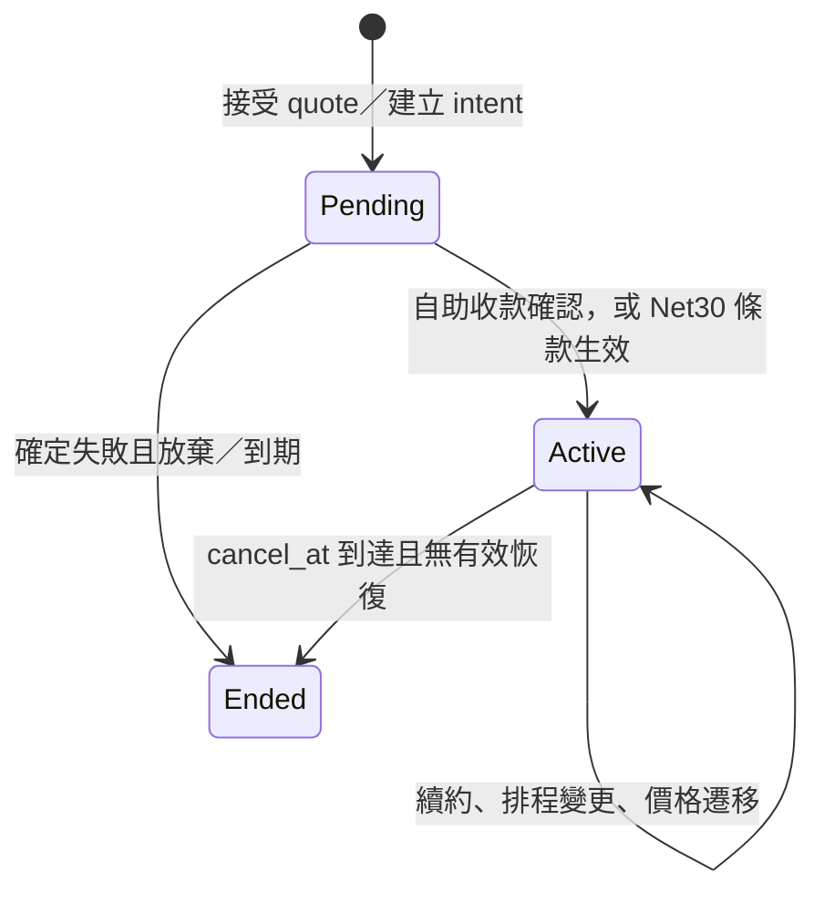

# B. 事實所有權、狀態與不變條件

狀態：設計契約，尚未由程式驗證。承接 [A 政策](01-pricing-and-policies.md)；情境驗算見 [C](03-scenarios-and-reconciliation.md)。同一經濟事實只有一個寫入者；其他模組保留引用或可重建投影。

## 事實及寫入責任

| 所有者 | 持久事實與唯一身分 | 可重建投影／禁止動作 |
| --- | --- | --- |
| Catalog | Product、Plan、sealed PriceVersion、CatalogSelection、EntitlementPolicyVersion；版本 ID 和 payload checksum | `current_price` 是查詢結果；發布後不改元件／捨入規則。 |
| Subscription | Subscription、PricingAssignment 的 `[start,end)`、SubscriptionChange、CustomerContractVersion、帳期錨點及 revision | `effective_plan` 從已提交 assignment 推出；請求 Pro 不等於已切 Pro。 |
| Measurement | UsageRecord 的 tenant＋source＋event_id／fingerprint、UsageAssignment、RatingRevision | 用量總和可重算；不覆寫原事件或換事件時間重送。 |
| Billing | BillingRun 的 period＋charge group＋revision、Invoice、不可變 InvoiceLine、Correction／CreditNote | 應收與未付額由核定票據、更正和 allocation 算出；不直接改原 invoice total。 |
| Payments | PaymentIntent、PaymentOperation、Attempt、ProviderObservation、RefundOperation、provider key | `paid` 從可核實 capture／allocation 推出；UNKNOWN 不是失敗。 |
| Receivables | CaptureAllocation、CreditGrant／Movement／Reservation、RefundReservation | 可用 credit、可退餘額均為來源受限的計算結果；不手改 balance。 |
| Entitlements | EntitlementDecision（來源版本、原因、起訖）、可重建 EntitlementProjection | 權益不是 Subscription.status 或 paid 布林值的副本。 |
| Operations | Inbox、Outbox、AuditEvent、ReconciliationRun、Discrepancy、RepairOperation | 修復也走原領域命令及同一唯一約束。 |

Customer、BillingAccountRef、BeneficiaryRef 是不同身分；lab 可一對一，但任何票據及權益都指向各自的主體。ContractVersion 只能覆寫白名單元件和付款條款，不能任意改 PriceVersion 內容。外部 provider 是 payment outcome 的來源，本地系統是自己義務、分配及服務決策的來源。

## 狀態轉移與原子邊界

Subscription 生命週期與以下狀態正交：invoice 為 `draft/finalized/voided_by_correction`（核定後仍保留原件）、operation 為 `created/submitted/unknown/succeeded/definitively_failed`、欠款為 `current/open/past_due`、權益為 `active/grace/suspended/expired`。`unknown` 可由查詢或可信 webhook 進到 `succeeded` 或有終局證據的 `definitively_failed`，不可因 timeout 自動進失敗。權益的 grace 以 invoice due date 和政策版本算出，非改 subscription status。

接受 Quote 的本地交易檢查 customer、quote expiry、payload fingerprint、subscription revision 和價格可選性，寫 change intent／PaymentOperation／audit／outbox。外部 capture 在交易後發送。收到結果時，inbox 去重、檢查 operation key／payload／幣別／金額、提交 observation 與 allocation，再推進 subscription、權益及 outbox；worker 崩潰後由已提交事實重建。Invoice 核定在一個本地交易中固定 input cutoff、rating revision、所有 line、total、唯一 period key 與 audit；provider 呼叫永不放在該交易內。

下期變更在週期界線按 subscription revision 比較並原子替換 assignment。期中自助升級先保留 Basic，有確定 capture 才決定 Pro 的服務起點；若先收款後開通，另作服務延遲更正。取消排程是 `cancel_at` 事實，恢復取消須在該時刻之前且帶 revision；已結束後需建立新服務期。

## I01–I21：反例與保護邊界

每一列給出能推翻宣稱的最小反例；後續實作應用它製作獨立 oracle 和故障注入，不能只測相同 helper 的回傳值。

| ID | 反例 | 保護點／應見證據 |
| --- | --- | --- |
| I01 | 兩行 $20、$10，Invoice.Total=$29.99。 | 核定交易以核定行重算 $30；同幣別約束。 |
| I02 | $0.001/task 逐筆捨入為 $0，使 10 筆應收為 $0。 | 保存十進位率及未捨入和；按元件×服務區段聚合，10 筆為 $0.01。 |
| I03 | 管理員把已引用的 pro-v1 $50 改 $60，舊單被重算。 | sealed payload／checksum、DB 禁止更新；新版本與更正另建。 |
| I04 | $40 行項只留 `plan=Pro`，查不到合約與服務期。 | 每行引用 assignment、PriceVersion、policy、contract、period、rating revision。 |
| I05 | 同一服務期同時有 v1 和 v2 兩筆有效 assignment。 | 同 scope 區間無重疊；migration 以 revision CAS 原子關閉舊段並開新段。 |
| I06 | Quote $40 後 catalog 改價，送 PSP 時變 $50。 | 接受時凍結 quote fingerprint 和 amount；送出只讀 PaymentOperation payload。 |
| I07 | capture timeout 後重建新 operation 再扣一次。 | 一義務唯一 operation／provider key；未決金額保留，先查原 operation。 |
| I08 | 同 key 第二次帶另一 seat count 卻收到舊成功。 | key scope＋payload hash 持久化；相同回原結果，不同回衝突。 |
| I09 | timeout 被當失敗而立即放行重試新 key。 | `unknown` 保留；lookup 或人工證據前不創第二經濟操作。 |
| I10 | success webhook 後到的舊 pending 把付款改回待處理。 | inbox event ID、operation 因果／終局狀態約束；矛盾觀察留證。 |
| I11 | 同 event_id 改 timestamp 重送，記為另一月用量。 | tenant＋source＋event ID 唯一，fingerprint 不同報 conflict。 |
| I12 | 晚到 10 tasks 每次重跑都追加 $0.01。 | 原期累計 rating revision 減已入帳累計，按穩定 correction key 只記差額。 |
| I13 | 9 月關帳後直接改 9 月發票總額。 | 核定資料不可更新；下一期 debit／credit 指回原期。 |
| I14 | $100 capture 同時發兩筆各 $70 refund。 | 對 capture 的已退＋未決保留 ≤ 可退額；同一 DB 交易預留。 |
| I15 | $20 credit 已抵 10 月帳，又被退款 $20。 | credit grant 的抵扣、退款、未決保留共用 $20 預算。 |
| I16 | 未付 $100 帳單改 $80 卻給客戶 $20 可退款 credit。 | 先減未付應收；只有已收且釋出分配的部分發 funded grant。 |
| I17 | 續約逾期第一分鐘把有 7 天 grace 的服務停掉。 | EntitlementDecision 記 due_at、policy version、grace deadline、reason。 |
| I18 | 成功提交 invoice 卻沒保存付款 outbox，永遠不扣款。 | invoice／audit／outbox 同交易；外部效果由可重跑 worker 恢復。 |
| I19 | 對帳只寫 `mismatch=true`，無從查 expected 和 actual。 | discrepancy 留來源 ID、觀察時間、兩邊值、分類及 evidence hash。 |
| I20 | repair job 重跑兩次，多發一張更正。 | RepairOperation 穩定 key、前置 revision、結果與事後核對；重跑回原結果。 |
| I21 | 已知成功 capture 的權益投影永遠停在 pending。 | 以已提交成功事實重建並告警停滯；provider 不可查時轉人工，不宣稱必然收斂。 |

I07、I14、I15 的保留額必須在 SQLite 寫入交易中檢查與建立，僅在應用層讀後計算不足以抵抗併發。I21 的活性前提是 worker／查詢可用、來源可核實且政策允許；單靠 DB 唯一鍵不能保證時間上的最終完成。
