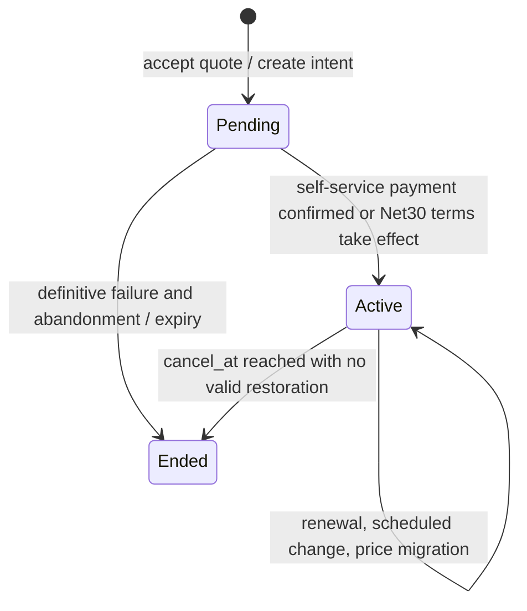

# B. Fact Ownership, State, and Invariants

**English** | [繁體中文](02-domain-and-invariants.zh-TW.md) | [简体中文](02-domain-and-invariants.zh-CN.md)

Status: Design contract, not yet verified by the process. It is the first of its kind in the world to receive the [A Policy](01-pricing-and-policies.md). In the context of the situation analysis, see [C](03-scenarios-and-reconciliation.md). There is only one writer of the same economic fact; Other modules retain references or can reconstruct projections.

## Facts and Writing Responsibility

|The owner.|It's the lasting truth and the only identity.|Can rebuild projections/prohibit actions|
| --- | --- | --- |
| Catalog | Product、Plan、sealed PriceVersion、CatalogSelection、EntitlementPolicyVersion； Version ID and payload checksum|`current_price` is the search result; No changes to the components/sharing rules after release.  |
| Subscription |`[start,end)`, SubscriptionChange, Customer ContractVersion, billing period focus and revision|`effective_plan` has been launched since the assignment has been submitted; Requesting Pro is not the same as cutting Pro.  |
| Measurement |UsageRecord's tenant+source+event_id/fingerprint、UsageAssignment、RatingRevision|Total measurements that can be recalculated; It is not possible to repeat the original event or to re-transmit the time of the event.  |
| Billing | BillingRun period, charge group, revision, Invoice, immutable InvoiceLine, Correction/CreditNote | Calculate receivables and outstanding amounts from finalized invoices, corrections, and allocations; never edit the original invoice total directly. |
| Payments | PaymentIntent、PaymentOperation、Attempt、ProviderObservation、RefundOperation、provider key |`paid` is introduced from verifiable capture/allocation; Unknown is not a failure.  |
| Receivables | CaptureAllocation, CreditGrant/Movement/Reservation, RefundReservation | Available credit and refundable balance are source-constrained calculations; do not edit a balance by hand. |
| Entitlements |EntitlementDecision (source version, cause, origin) can be reconstructed with EntitlementProjection|The entitlement is not a copy of the Subscription.status or paid bullet value.  |
| Operations | Inbox、Outbox、AuditEvent、ReconciliationRun、Discrepancy、RepairOperation |Repair also goes beyond the original domain command and the same only constraint.  |

Customer, Billing Account, Beneficiary Ref is different. lab can be one-on-one, but any notes and entitlements point to their respective subjects. ContractVersion can only overwrite the whitelist components and payment terms, and PriceVersion content cannot be changed arbitrarily. External providers are the source of payment outcomes, and local systems are the source of their own obligations, allocations and service decisions.

## State transition to atomic boundary

Subscription Lifecycle is in the following states: Invoice for `draft/finalized/voided_by_correction` (the original remains valid) Operation for `created/submitted/unknown/succeeded/definitively_failed`, Debt for `current/open/past_due`, Entitlement for `active/grace/suspended/expired`. `unknown` can be accessed by a search or trusted webhook to `succeeded` or `definitively_failed` with end-to-end proof, and cannot be automatically accessed due to timeout. The grace of entitlement is calculated on the basis of invoice due date and policy version, without changing subscription status.

Take a look at the customer, quote expiry, payload fingerprint, subscription revision and price selectivity, and write change intent/PaymentOperation/audit/outbox. External capture sent after the transaction. When the result is received, the inbox is loaded, checks the operation key/payload/currency/quantity, submits the observation and allocation, and then pushes the subscription、entitlement and outbox; The worker was rebuilt after the collapse by the fact that it had been submitted. Invoice validates the fixed input cutoff, rating revision, all line, total, only period key and audit in a local transaction; The provider calls are never included in the transaction.

Subsequent phase changes in the cycle line are compared by subscription revision and atomic substitution assignment. During self-upgrades, Basic will be retained and the service start point for Pro will be determined by a certain capture. If the service is opened after receipt, the service is also delayed. The cancellation schedule is `cancel_at` in fact, and recovery cancellation must be done before that time and with revision; After the end of the service, a new service period is created.

## I01 I21: Counter-cases and border protection

Each row gives the minimum set of counter-cases that can overturn a claim; Subsequent applications have been made to create independent oracles and fault injections, and cannot only measure the return value of the same helper.

| ID |Contrary to|Protected Areas / Should Be Witnessed|
| --- | --- | --- |
| I01 |The two lines are $20, $10, Invoice.Total = $29.99..  |the settlement of the settlement transaction at a settlement of $30; It's not the same.  |
| I02 |$0.001/task is $0 per penny, so 10 pennies are $0.0 per penny.  |maintaining the ten-point average and uninterrupted balance; The sum of 10 pence by component x service area is $0.01.  |
| I03 |The administrator changed the $50 pro-v1 quoted to $60, and the old one was recalculated.  |Seated payload/checksum, DB banned updates; New version and rebuilt.  |
| I04 |The $40 line left only `plan=Pro`, excluding contracts and service periods.  |Each line refers to an assignment, a price version, a policy, a contract, a period, a rating revision.  |
| I05 |There are two valid assignments for both v1 and v2 during the same service period.  |There is no overlap between the scope spaces; migration uses the revision CAS atom to close the old section and open the new section.  |
| I06 |Quote $40 after catalog change, PSP time change to $50..  |The freezing of quote fingerprint and amount; Payment Operations payloads are read only.  |
| I07 |After capture timeout, restart the new operation and restart it once again.  |A single obligation operation/provider key; The remaining amount is reserved and the original operation is checked.  |
| I08 |The second time with the same key, another seat count was the same success.  |Key scope + payload hash persistence The same result, different conflicts.  |
| I09 |Timeout is released as soon as the new retry key fails.  |`unknown` is maintained; Do not create a second economic operation before a lookup or artificial evidence.  |
| I10 |After success webhook, old pending payments are returned to processing.  |Inbox event ID, operation, cause/end state constraints; Contradictory observation of the evidence.  |
| I11 |Change the timestamp with the event_id and re-send the timestamp for the next month's usage.  |Tenant+source+event ID is unique, and the fingerprint is different from the reporting conflict.  |
| I12 |After 10 late tasks, $0.01 is added for each run.  |Initial cumulative rating revision Depreciation of cumulative accounts, with only the difference noted in the stable correction key.  |
| I13 |In September, the total of the invoices were directly changed after the closure of the accounts.  |verification data cannot be updated; The next period of debit/credit refers to the original period.  |
| I14 |$100 capture and two $70 refunds.  |Returns + undecided withholding of capture ≤ redeemable; The same DB transaction is reserved.  |
| I15 |The $20 credit has arrived at the October account and $20 has been refunded.  |Credit grant deductions, withdrawals, withholding a shared $20 budget.  |
| I16 |A $100 bill is not paid, and $80 is credited to the customer for $20 that can be refunded.  |the first reduction of the outstanding receivables; Only the part of the grant funded that has been received and distributed.  |
| I17 |The first minute of the extended period suspended the seven-day grace service.  |EntitlementDecision marked due_at, policy version, grace deadline, reason.  |
| I18 |In the case of a successful invoice, the payment is not stored in the outbox and is never withdrawn.  |In the case of a business transaction, the transaction will be executed in the form of an invoice/audit/outbox. External effects are restored by the worker who can run.  |
| I19 |reconciliation only writes `mismatch=true`, without checking expected and actual.  |discrepancy: keep source ID, observation time, two-sided values, classification and evidence hash.  |
| I20 | Retry a repair job twice and request one extra correction. | Use a stable RepairOperation key, expected revision, outcome, and post-repair reconciliation; retries return the original result. |
| I21 |Entitlement projections for the successful capture are pending forever.  |Rebuild successful facts and alert the police to a stall; The provider cannot check the time of the transfer and does not declare that it is necessary to cross-check.  |

Reservations of I07, I14 and I15 must be checked and created in SQLite's written transactions, and are not sufficient to resist concurrent computation after reading the application layer. Activity of I21 is subject to worker/search availability, source verifiability and policy permission; The only key that can guarantee a timely completion is DB.
