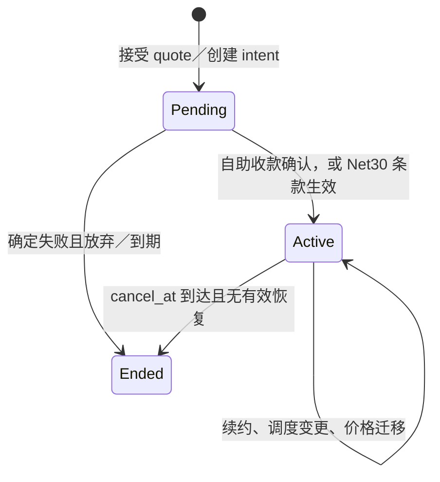

# B. 事实所有权、状态与不变条件

[English](02-domain-and-invariants.md) | [繁體中文](02-domain-and-invariants.zh-TW.md) | **简体中文**

状态：设计契约，尚未由程序验证。承接 [A 政策](01-pricing-and-policies.zh-CN.md)；情境验算见 [C](03-scenarios-and-reconciliation.zh-CN.md)。同一经济事实只有一个写入者；其他模块保留引用或可重建投影。

## 事实及写入责任

| 所有者 | 持久事实与唯一身分 | 可重建投影／禁止动作 |
| --- | --- | --- |
| Catalog | Product、Plan、sealed PriceVersion、CatalogSelection、EntitlementPolicyVersion；版本 ID 和 payload checksum | `current_price` 是查找结果；发布后不改组件／舍入规则。 |
| Subscription | Subscription、PricingAssignment 的 `[start,end)`、SubscriptionChange、CustomerContractVersion、帐期锚点及 revision | `effective_plan` 从已提交 assignment 推出；请求 Pro 不等于已切 Pro。 |
| Measurement | UsageRecord 的 tenant＋source＋event_id／fingerprint、UsageAssignment、RatingRevision | 用量总和可重算；不覆写原事件或换事件时间重送。 |
| Billing | BillingRun 的 period＋charge group＋revision、Invoice、不可变 InvoiceLine、Correction／CreditNote | 应收与未付额由核定票据、更正和 allocation 算出；不直接改原 invoice total。 |
| Payments | PaymentIntent、PaymentOperation、Attempt、ProviderObservation、RefundOperation、provider key | `paid` 从可核实 capture／allocation 推出；UNKNOWN 不是失败。 |
| Receivables | CaptureAllocation、CreditGrant／Movement／Reservation、RefundReservation | 可用 credit、可退余额均为来源受限的计算结果；不手改 balance。 |
| Entitlements | EntitlementDecision（来源版本、原因、起讫）、可重建 EntitlementProjection | 权益不是 Subscription.status 或 paid 布尔值的副本。 |
| Operations | Inbox、Outbox、AuditEvent、ReconciliationRun、Discrepancy、RepairOperation | 修复也走原领域命令及同一唯一约束。 |

Customer、BillingAccountRef、BeneficiaryRef 是不同身分；lab 可一对一，但任何票据及权益都指向各自的主体。ContractVersion 只能覆写白名单组件和付款条款，不能任意改 PriceVersion 内容。外部 provider 是 payment outcome 的来源，本地系统是自己义务、分配及服务决策的来源。

## 状态转移与原子边界

Subscription 生命周期与以下状态正交：invoice 为 `draft/finalized/voided_by_correction`（核定后仍保留原件）、operation 为 `created/submitted/unknown/succeeded/definitively_failed`、欠款为 `current/open/past_due`、权益为 `active/grace/suspended/expired`。`unknown` 可由查找或可信 webhook 进到 `succeeded` 或有终局证据的 `definitively_failed`，不可因 timeout 自动进失败。权益的 grace 以 invoice due date 和政策版本算出，非改 subscription status。

接受 Quote 的本地交易检查 customer、quote expiry、payload fingerprint、subscription revision 和价格可选性，写 change intent／PaymentOperation／audit／outbox。外部 capture 在交易后发送。收到结果时，inbox 去重、检查 operation key／payload／币别／金额、提交 observation 与 allocation，再推进 subscription、权益及 outbox；worker 崩溃后由已提交事实重建。Invoice 核定在一个本地交易中固定 input cutoff、rating revision、所有 line、total、唯一 period key 与 audit；provider 调用永不放在该交易内。

下期变更在周期界线按 subscription revision 比较并原子替换 assignment。期中自助升级先保留 Basic，有确定 capture 才决定 Pro 的服务起点；若先收款后开通，另作服务延迟更正。取消调度是 `cancel_at` 事实，恢复取消须在该时刻之前且带 revision；已结束后需创建新服务期。

## I01–I21：反例与保护边界

每一列给出能推翻宣称的最小反例；后续实作应用它制作独立 oracle 和故障注入，不能只测相同 helper 的回传值。

| ID | 反例 | 保护点／应见证据 |
| --- | --- | --- |
| I01 | 两行 $20、$10，Invoice.Total=$29.99。 | 核定交易以核定行重算 $30；同币别约束。 |
| I02 | $0.001/task 逐笔舍入为 $0，使 10 笔应收为 $0。 | 保存十进位率及未舍入和；按组件×服务区段聚合，10 笔为 $0.01。 |
| I03 | 管理员把已引用的 pro-v1 $50 改 $60，旧单被重算。 | sealed payload／checksum、DB 禁止更新；新版本与更正另建。 |
| I04 | $40 行项只留 `plan=Pro`，查不到合约与服务期。 | 每行引用 assignment、PriceVersion、policy、contract、period、rating revision。 |
| I05 | 同一服务期同时有 v1 和 v2 两笔有效 assignment。 | 同 scope 区间无重叠；migration 以 revision CAS 原子关闭旧段并开新段。 |
| I06 | Quote $40 后 catalog 改价，送 PSP 时变 $50。 | 接受时冻结 quote fingerprint 和 amount；送出只读 PaymentOperation payload。 |
| I07 | capture timeout 后重建新 operation 再扣一次。 | 一义务唯一 operation／provider key；未决金额保留，先查原 operation。 |
| I08 | 同 key 第二次带另一 seat count 却收到旧成功。 | key scope＋payload hash 持久化；相同回原结果，不同回冲突。 |
| I09 | timeout 被当失败而立即放行重试新 key。 | `unknown` 保留；lookup 或人工证据前不创第二经济操作。 |
| I10 | success webhook 后到的旧 pending 把付款改回待处理。 | inbox event ID、operation 因果／终局状态约束；矛盾观察留证。 |
| I11 | 同 event_id 改 timestamp 重送，记为另一月用量。 | tenant＋source＋event ID 唯一，fingerprint 不同报 conflict。 |
| I12 | 晚到 10 tasks 每次重跑都追加 $0.01。 | 原期累计 rating revision 减已入帐累计，按稳定 correction key 只记差额。 |
| I13 | 9 月关帐后直接改 9 月发票总额。 | 核定数据不可更新；下一期 debit／credit 指回原期。 |
| I14 | $100 capture 同时发两笔各 $70 refund。 | 对 capture 的已退＋未决保留 ≤ 可退额；同一 DB 交易预留。 |
| I15 | $20 credit 已抵 10 月帐，又被退款 $20。 | credit grant 的抵扣、退款、未决保留共用 $20 预算。 |
| I16 | 未付 $100 帐单改 $80 却给客户 $20 可退款 credit。 | 先减未付应收；只有已收且发布分配的部分发 funded grant。 |
| I17 | 续约逾期第一分钟把有 7 天 grace 的服务停掉。 | EntitlementDecision 记 due_at、policy version、grace deadline、reason。 |
| I18 | 成功提交 invoice 却没保存付款 outbox，永远不扣款。 | invoice／audit／outbox 同交易；外部效果由可重跑 worker 恢复。 |
| I19 | 对帐只写 `mismatch=true`，无从查 expected 和 actual。 | discrepancy 留来源 ID、观察时间、两边值、分类及 evidence hash。 |
| I20 | repair job 重跑两次，多发一张更正。 | RepairOperation 稳定 key、前置 revision、结果与事后核对；重跑回原结果。 |
| I21 | 已知成功 capture 的权益投影永远停在 pending。 | 以已提交成功事实重建并告警停滞；provider 不可查时转人工，不宣称必然收敛。 |

I07、I14、I15 的保留额必须在 SQLite 写入交易中检查与创建，仅在应用层读后计算不足以抵抗并发。I21 的活性前提是 worker／查找可用、来源可核实且政策允许；单靠 DB 唯一键不能保证时间上的最终完成。
