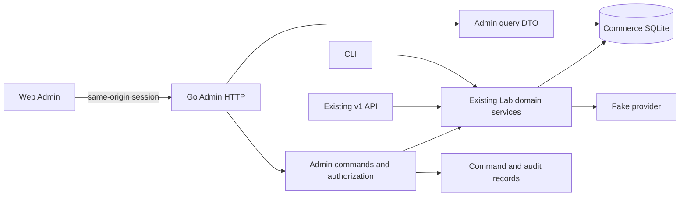

# Web Admin Design

**English** | [繁體中文](05-web-admin.zh-TW.md) | [简体中文](05-web-admin.zh-CN.md)


Status: Design and implementation planning completed, Web Admin implementation underway. React、Ant Design and `.env` single logins have been confirmed by users. Based on the CLI, `api.New` routes and field services in the 2026-09-26 work zone. The scope of the functionality is determined by the progress record in [Action Plans](07-web-admin-implementation-plan.md).

## 1. Objectives and scope

It allows the operator to complete business operations with existing CLI in the browser and answer: what customers currently buy, how much they deal with, how much they actually pay, whether the service is open, what steps to take, and what can be done next.

The first version uses the native Go+SQLite, fake provider, and existing monetary policy. Provides full functional input, understandable status, operational preview and traceable results. Real money flows, taxes, multi-currency, official accounts and Internet deployments are restricted along the original MVP scope.

** Complete condition is that all functions are operational and searchable in the table below. ** Phase delivery is only in executive order, without reducing the final scope. Simulation time and fault injection are also preserved, but focus on the clearly marked "Lab" page.

## 2. Current status and parts needed to be added

|There is evidence.|Design meaning|
| --- | --- |
|`cmd/lab/menu.go` has 13 main menu groups, which include subscriptions, payments, refunds, availability, contracts, reconciliation and two migrations.|A full list of CLI features as a benchmark for Web acceptance.|
|`api/v1.go` is currently offering offers, new purchases, subscription changes/searching, invoices/entitlement readings, write-in volumes and a few internal operations.|It is not possible to simply add a form to an existing API; It's still necessary to manage the search and command interfaces.|
|`lab/inspect.go`'s `State` can read all the data to CLI at once.|The Web needs to split pages, filter, specify DTO; It doesn't directly transmit the entire state to the browser.|
|CLI and HTTP share a service in the `lab` domain.|Quantity calculations and status checks continue to be carried out by the Go sector.|
|`cmd/lab/serve.go` only allows loopback; Internal API using server-set tokens|Adding browser session and administrative permissions; Internal tokens don't put the front end bundle in.|
|The CLI simulation clock is located in the menu instance; HTTP servers are currently running real time.|The time control of the Web requires a clear server clock to be inserted and isolated, and cannot be assumed to exist.|

Sources: [interactive CLI](../implementation/interactive-cli.md), [v1 API](../implementation/phase-p2-v1-api.md), and [account migration](../implementation/phase-p3-account-cutover.md).

## 3. Guide and feature coverage

The left-hand guide is named for the purpose of the work; Each detailed page is linked to relevant customers, subscriptions, invoices, payments and operating records.

|This is a list of articles related to Wikipedia.|Find the content.|It has to be functional.|The main sources are:|
| --- | --- | --- | --- |
|What is the meaning of this?|Payment/return, receipt of bills, grace/ suspension of subscriptions, reconciliation differences, conflict migration|entering the object to be processed; The results of the observation are updated.|Manage the search for DTO|
|Customers and subscriptions|Subscriptions, actual prices and target prices, seats, billing period, revisions, entitlement sources, timeline|Basic/Pro/ has released SKU offers and new purchases; Changes to the next phase of the program; Cancellation of the term; Cancellation of recovery before entry into force; Pro upgrades during the period| `lab.go`、`subscription_changes.go`、`immediate.go` |
|Accounts and credits|Original invoice lines, source version, deduction correction, balance of dealing, credit source and balance, application record|Correction of deductions; credit for follow-up bills; delayed reopening; In the meantime, we're going to have to make a decision.| `corrections.go`、`immediate.go` |
| Payments and refunds | Payment obligation, attempt, provider observation, allocation; Refunds withheld/withdrawn/unknown amount | Create partial or residual payments; Retry after failure; Send the next payment; Verify with the original key; Keep the refund amount, send refunds, and verify | `billing.go`、`refunds.go`、`lab.go` |
|Prices and products|PriceVersion, components, checksum, meter, cohort catalog selection history|The new version of Pro is released. Registered meter; publishing a configured price measurement; Specify the cohort New purchase price| `catalog_admin.go`、`meter_catalog.go` |
|Price migration|Preview Differences per client, batch/project status, causes of conflict with new and old assignments|Preview, create batches, pause, briefly scan conflict pages, recover after re-checking; The reverse migration is expressed in new batches.| `price_migration.go` |
|How much is the amount of food?|Meters, cancellation relationships, billing period summaries, rating versions, delayed differences with outstanding credit notes|Record the events, cancel the events, close the accounts, delay to recalculation, over the account balance CreditNote| `usage.go` |
|Corporate contracts|Client contract version, seat/price terms, deadline, Net30 expiration, subsequent price or hold|issuing a contract; Create/accept a contract offer; The final invoice is sent to the receipt queue.| `contracts.go`、`contract_accept.go` |
|Reconciliation and Reconciliation|Run, Discrepancy, Expected/actual, Evidence, Source Revision, Repair and Re-Check results|Run reconciliation, look for differences, specify repair/original keys, look for, record artificial resolutions| `reconciliation.go`、`reconciliation_repair.go` |
| Account migration | Legacy/customer/beneficiary mapping, shadow comparison, source backfill, read and write owners, stop reasons | Create mappings; compare shadow quotes and entitlements; backfill and review corrections; check readiness; switch readers and writers; stop new commands and migration; inspect entitlements through the adapter | `account_migration.go` |
|Work and operation records|Expired work, outbox, manage commands, progress, results link to cause and effect.|the expiry date; Rebuild the entitlement; Find or restore existing commands. Repair by re-conciliation entrance.|`billing.go`, `entitlements.go`, adding the management command record|
|The lab.|Simulated time, fake provider status and activated failures|• Adjusting the simulation time; Set the following payment/withdrawal result; Support the existing lost response and disruption situations of the CLI| `cmd/lab/menu*.go`、`provider.go` |

"Customers" are the first to look at the existing customer ID, not claiming to have a complete CRM or billing account model. The difference between the beneficiary, the customer and the legacy account is clearly marked on the migration page.

## 4. Page design and interaction

### Customer/subscription workshops

Subscribe details as the most commonly used workstation:

```text
Local lab | simulated time / real time | last updated | operator
Customer > Subscription sub_…       [Create change] [Cancel / restore]
Plan Pro v1 · 5 seats · USD · revision 12

Billing: paid    Payment: confirmed    Service: active    Next period: Pro v2 expected

[Overview] [Periods and invoices] [Payments / refunds] [Usage] [Entitlement sources] [Activity]

Current period 09/01–10/01           Pending
Applied price and seats              1 payment awaiting verification → View
Paid / outstanding / available credit  Entitlement source revision 11, subscription 12 → View

Timeline: command accepted → invoice finalized → payment observed → entitlement updated
```

Separate accounts, payments, services and future intentions show that they are not merged into an easily misunderstood "success". The timesheet shows the time and source of the system, not the order of the constituent form factor.

The table is presented in a 224px sidebar, with the main content and details drawn; Forms support search, filtering, ranking and page segregation. The drawer is only responsible for viewing and making complex changes using a full page or step sheet. The URLs save the location of the filter and the split page, and return to the previous page without losing the context. The narrow screen retains the main information and the complex amount table can be rolled horizontally.

### Operating process

1. ** Select objects and intentions**: automatically introduce objects starting from the subscription or invoice page; Explain the scope of the operation.
2. **Input and preview**: Displays the source version, current/changed seats, breakdown of amounts, time of effect, effects on entitlement and reasons why it cannot run.
3. ** Confirmation and submission**: The amount or the subscriber's change needs to be explicitly confirmed; The reason for the input. In general, reading and refreshing do not add to the confirmation steps.
4. ** Tracking results**: Displays different stages of command acceptance, payment processing, domain completion, entitlement projection and repair verification; It's easy to leave the page and go back and track it.

Preview is not a reservation, nor is it a successful run. The server re-verifies the revision, price, seats, deadlines and limits in the actual command transaction. The front end does not calculate the amount of authority, and does not maintain the condition by hiding the button.

### Offers and mid-term upgrades

The offerings also show "Now dealt with", "Fixed Commitments for the next full term", "Use Rate", "Tax unsupported". Schedule changes are now dealt with at 0. Medium-period upgrades along the `due_now_estimated=true`, specifying the estimated timing with "re-computing when submitted". After actual receipt, the payment obligation is displayed with `pending_amount_minor` and no copy of the preview amount can be used as a receipt basis.

Add a confirmation preview for admin, a forwarding timeframe, an opaque token of the operator/object/operation/request hash; The token refers to the data stored on the server and cannot be rewritten by the browser itself. The quantity-sensitive command must have a preview version with the quantity limit: when running the calculation exceeds the confirmed quantity, or the range of changes affected, go to `409 PREVIEW_STALE` and request a review. This is an add-on, and the existing `v1` has not yet offered this guarantee.

A mid-term upgrade, if the recalculation amount decreases, allows operations within the established ceiling, which results in a listing of the valuation and the actual amount; Ascension is confirmed again. The specified amount of refund and credit application cannot be automatically replaced. This policy is a management decision of this proposal and needs to be fixed in practical testing.

### State of exception

|The situation.|It's a great way to get a feel for the images and the behaviour.|
| --- | --- |
|Payment/Return Unknown|Displays "results pending verification", the initial operation and the last observed time; It provides the original key for search and does not provide a blind return of the same obligation.|
|Identifying Failure|the reasons for this; Only open retry when allowed by the domain and retain the old and new attempted relationship.|
|revision Conflict|Keep the intent of the form, upload the latest data, display the differences, re-preview; It doesn't automatically change the revision and send it out.|
|Offer expires or catalog changes.|Show the original/new price and the reason for the re-creation of the offer; No renewal of the original offer|
|Right now, we're looking at a new way of doing things.|Separately display subscription revision with entitlement source revision, mark "in sync" and provide authorized repair input.|
| Net30 |Displays "Opened/not paid/expired date"; Zero now doesn't mean the whole contract is free.|
|The price has been announced.|It's just reading. The "Create the Next Version" operation does not show the editing of the existing amount button.|
| Partial price-migration conflict | Show each account’s status and reason. Pausing stops later items but does not undo items already applied. |
|High-risk reconciliation differences|Demonstrate evidence with expected/actual, recording artificial resolutions; The artificial resolution itself is not the same as the funds being amended.|
|After the account is deleted, stop.|Displays the actual read/writer owner and stop range; Stop not automatically cutting writer back to legacy.|
|The web is outdated or the page is redesigned.|Search for an existing command ID or original request key to restore progress; It's not about the financial intentions.|

The state is represented by text, symbols and colors. The form must have a keyboard operation, clearly label and field errors; Confirmation boxes respond to the focus. The quantity shows the denomination of the currency as opposed to the formatted value, showing the original minor units visible; The rational use rate maintains the molecular/separator, not using floating point approximation.

## 5. Technical architecture

Using the confirmed React+TypeScript+Vite, Ant Design unifies the page structure, forms, forms, dialog boxes, messages and status components; Use TanStack Query to read cache and background updates, react routers to manage routes, and Zod to verify API data and input formats. The form is Ant Design Form, and no longer combines with React Hook Form or Radix UI. Subject, component boundaries and financial operations restrictions see engineering contract. Go is still the only business backend, while SQLite is still the native data source.



The front end source code is `web/admin/`; Add a management handler to place `api/admin/`; Manage to find and coordinate transaction with command to place `lab/admin_*.go`, reuse area transaction helpers, to avoid rebuilding a second set of business rules or loop dependencies.

Vite proxy to Go while developing; When delivered, the product will be built into the Go binary, with the same origin provided by `/admin/` and `/admin/api/`. Maintain the compatibility of existing `serve` commands and add independent `admin` commands; Manage listener does not include unauthorized v1 routing, and this command is not available at this time. Pure API builds should not be compileable due to lack of front-end dist.

The progress of the first edition of the survey was updated manually, with the last observation time reserved; You don't need to create a WebSocket system first. See page queries and cancel unused requests when switching pages. The commands are not available until after the command has been executed. Financial writing is not optimistic and updates pretend to be successful.

## 6. Manage API and command contracts

The following are all the management routes to be added, not to claim that an existing v1 already exists. The `/admin/api` forecast is omitted in the table. The front end uses the administration session, managing the handler to call the domain services directly, without holding an internal API token through the browser.

|The API group|Readings will be provided.|It's about giving commands.|
| --- | --- | --- |
| `/admin/api/overview`、`/customers`、`/subscriptions` |This is a list of pages, searches, subscription details and timelines.| quotes、accept、schedule、cancel、resume、immediate-upgrade |
| `/invoices`、`/credits` |Source of bills, balance, credit allocation and refunds| reduction、apply-credit、late-activation-correction、unfulfilled-change-resolution |
| `/payments`、`/refunds` |Obligations, attempts, unknowns, reservations and results| create、retry-failed、dispatch、reconcile、reserve-refund |
| `/prices`、`/meters`、`/catalog-selections` |Components, checksum, catalog selection and history| publish-price、register-meter、select-catalog-price |
| `/price-migrations` |Preview, batches, progress and conflicts per household| plan、pause、skip-item、resume |
| `/usage-events`、`/usage-periods` |Events, ratings, delays and credit notes| record、adjust、close、rerate、post-credit-notes |
| `/contracts` |Terms, expiration, retention price and receipt status| publish、quote、accept、collect-due |
| `/reconciliation-runs`、`/discrepancies` |Run, proof, repair before and after the results.| run、repair、record-manual-decision |
| `/account-migrations` |Map, source, shadow, threshold, owner, adapter view| link、shadow、backfill、resolve-provenance、switch-read、switch-writer、stop |
| `/commands`、`/jobs` |Command response, traceable work and recovery status|Run-renewals, refresh-entitlements, run-controlled work|
| `/lab` |The server clock, the isolated state of the fake provider.| set-clock、set-provider-decision、inject-supported-fault |

Each mutation defines a dedicated payload and endpoint, such as `POST /admin/api/subscriptions/{id}/cancel`; Do not accept any arbitrary function name or SQL. The full OpenAPI should be maintained along with the implementation.

** Read the contract**: cursor section, boundary limit, stable ordering, allowing field selection, `as_of` and applicable `source_revision`. The list shows only the necessary information; The original provider key is a diagnostic field controlled by authorization. A cross-page overview is a summary of the observed time, not claiming to share the same snapshot with all subsequent details.

**Command pact**: Object ID, typeed payload, cause, `Idempotency-Key`, expected revision and preview token applicable. actor from the session, cannot trust the browser's actor ID. The amount is still used for the total minor units; It is sent in ten-digit strings across the JS security integer range. The new Admin DTO can use the same string without changing the existing v1.

Added `admin_commands`: command ID, actor, type, target, request key, payload hash, preview version, state, result reference, error code, time of creation/updating. The request key defines uniqueness as actor and command scope; The same key, different payload, conflict. The command search also has object and character authorization.

Shortcommands can be executed directly and retransmitted as a result of a reference; Interruptible/long working back to `202` with command ID. HTTP receipt is successful, commands are completed, payment is confirmed, service is open in different states. The command status is at least `accepted/running/succeeded/failed/waiting_verification`; It is impossible to write a general failure when it cannot be judged and to put new attempts into practice.

** Transaction and Restore are Add-On Engineering**: Existing field methods start transactions on their own and `Lab` limits the number of database connections; The wrapper manager must not first hold the transaction and then call it. To record command receipt/audit with business facts in field transactions; The provider side effect is also available with an outbox/operation key and verification based on the original operation. Each path is to deal with interruptions of "business submitted successfully, command records not updated" and then to check the results with the business key. For the batch of work that was missing the request key, it is necessary to replenish the job identity and individual idempotentity, and it is not possible to add only one management command sheet to claim to guarantee rebroadcasting.

## 7. Authorisation, auditing and isolation of laboratories

The web version lacks a fully authorized operator, but all management APIs are still using the same permission middleware; `BILLFORGE_ADMIN_CAPABILITIES` can be used to limit the ability of the account to a multi-column without the need to develop an account management product. From `.env` upload `BILLFORGE_ADMIN_USERNAME`、`BILLFORGE_ADMIN_PASSWORD`, to log in and create a server session to `/admin/login`; The session cookie uses HttpOnly, SameSite, and Secure when it is officially HTTPS. Origin/CSRF authentication is written and the internal token is not delivered to the browser. Linking loopbacks alone is not enough to prevent other websites from triggering native requests.

Authorisation by capability:`read`、`subscription.manage`、`finance.adjust`、`catalog.publish`、`migration.manage`、`reconciliation.repair`、`operations.run`、`usage.manage`、`contract.manage`、`lab.control`In addition to the support, finance, and catalog admin roles, it is also possible to combine the following roles: The front end capability is displayed with the rear end running check source synchronization. Cross-operator and cross-object access shall include denial of testing.

Each financial/batch command keeps actor, reason, request ID, object, source version, amount of impact and result citation. No complete credentials or sensitive provider payload should be stored in normal operating records. The audit of existing areas cannot be directly considered as a complete management audit trail; It is necessary to add fields and transaction links.

Laboratory functionality is controlled simultaneously by server settings and capability, with the page brows permanently displaying the environment and clock; The settings only affect the specified native environment and are not included in the default options on the general payment form. the bid/billing period that will be affected before the change of time; Coordination with the running command when adjusting, prohibiting the same command from using two simulation moments before and after. The Commission shall adopt a decision on the implementation of the measures provided for in this Regulation. The operator triggers the expired work.

## 8. Operational order and acceptance

|Stages|Delivery|Exit conditions|
| --- | --- | --- |
|W1 Management Basics and Reading|The same source front end, session, permissions, split-page API, overview, subscription/invoice details, shared status components|If the fixture is correctly paid, unknown, grace, Net30, the projection is delayed; Unlicensed API refusal; The old CLI/v1 regression was passed.|
|W2 subscription workflow|New purchases, offers, schedules, cancellations, restorations, mid-term upgrades, command tracking and previews|Seat/price/revision quotes are selected; Rejection of expiration and antiquated preview; Refreshing retrieves the same command.|
|W3 Finance and Operations|Payments, withdrawals, credits, corrections, renewals, entitlement work, reconciliation and artificial resolutions|The source of the amount can be traced; Unknown source operation; No repeat reservations/payments; I've seen the results of the repair and re-check.|
|W4 products and billing platform|Price/meter, cohort, quantity, contract, price migration|It's read-only. Late-to-use new ratings and differences; Net30 expiry behavior; Some of the migration conflicts have not been misreported as successful.|
|W5 accounts migrated to the lab.|All P03 operations, simulated clocks, fake provider failures and status.|It is not possible to cut off the preparation; The scope of the stop is clear; the original operation can still be verified after failure; All the entrances are complete.|

Go domain tests continue to verify the amounts and trading rules; Add HTTP contract tests to verify permissions, payloads, errors, split pages, previews and command replay. Playwright runs the real-world Go server, independently temporarily storing SQLite with the fake provider, verifying the visible results of the operation, and avoiding mocking the successful response.

At the very least, the following complete process is actually validated:

- New purchases → Lost payment responses → UI showing for verification → Original key verification → entitlement open, only one successful capture.
- The secondary schedule and the intermediate upgrade respectively show the correct response times; After the other operator modified the revision, the old preview was rejected and no bills/payments were generated.
- Reduction correction → funded credit → Subscription part/Return of refund → Return UNKNOWN → Verification, retention and availability of the available amount are correct and traceable.
- Usage events → Closed accounts → Late to/Canceled → Recalculation → Correct difference or CreditNote, historical rating retained.
- The price migration includes normal households, conflict households, suspension/restore; It has been dealt with that the user will not be relocated again due to rebroadcasts.
- Net30 is open after acceptance and receipts are listed only when they expire. Holds are displayed when there is no follow-up price.
- reconciliation discovery of differences → correction preview → revision change rejection → re-verification after processing, the results provide evidence and verification run.
- Account shadow/source replenishment → readiness → deleting → deleting → stopping; Confirm that only the specified writer can accept the new command.
- After "command acceptance" and "business commits", before administering the response, the server is interrupted, restarted or refreshed, returning the same result without a second financial obligation.

The first edition did not report revenue growth as the acceptance goal. The first is to provide a reliable operational framework; If MRR/ARR is added, the contract, refund, correction, volume and quality are altered, and the report is created.

## 9. Design completion and interaction

This document completes the directions, the full CLI capability control, the main images, the amount/state interactions, the back end gaps, the management end permissions, the delivery and acceptance standards in stages. The next step is to start with W1 and eventually complete W1 and W5 before Web Admin can be called.

The price/payment policy is based on both AD and practical documentation. New preview limit, session management, command persistence and auditing requirements are designed to be added to this template; This document should not be considered as evidence that these functions already exist.

Complete engineering and operation interfaces: [06 Engineering contract](06-web-admin-contracts.md), [07 Plans for action](07-web-admin-implementation-plan.md), [08 Acceptance Scheme](08-web-admin-test-plan.md). The wheel is still in design and planning, and has not yet started W1 or created an actual tent seal.
