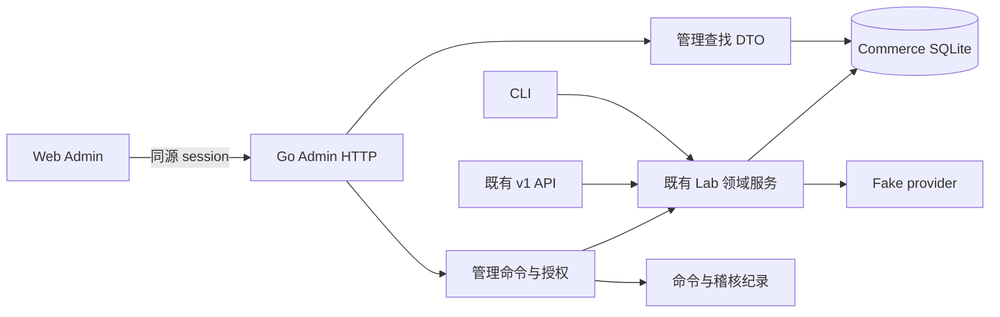

# Web Admin 设计方案

[English](05-web-admin.md) | [繁體中文](05-web-admin.zh-TW.md) | **简体中文**


状态：设计与实作规划完成，Web Admin 实作进行中。React、Ant Design 与 `.env` 单一管理帐密登录已由用户确认。以 2026-09-26 工作区的 CLI、`api.New` 路由与领域服务为依据。功能完成范围以[实作计划](07-web-admin-implementation-plan.zh-CN.md)中的进度纪录为准。

## 1. 目标与范围

让操作者可以在浏览器完成现有 CLI 的业务操作，并回答：客户目前买了什么、应付多少、实际付了多少、服务是否开通、哪一步待处理，以及下一步可以做什么。

第一版沿用本机 Go＋SQLite、fake provider 与既有金额政策。提供完整功能入口、可理解的状态、操作预览与可追查的结果。真实金流、税、多币别、正式总帐及互联网部署沿用原有 MVP 范围限制。

**完成条件是下表全部功能可操作及查找。** 分阶段交付只是实作顺序，不缩减最终范围。仿真时间与故障注入也保留，但集中在清楚标示的「实验室」页面。

## 2. 现况与需要添加的部分

| 现况证据 | 设计含义 |
| --- | --- |
| `cmd/lab/menu.go` 有 13 组主菜单，子菜单涵盖订阅、付款、退款、用量、合约、对帐及两种迁移 | 以完整 CLI 功能清单作为 Web 验收基准 |
| `api/v1.go` 目前提供报价、新购、订阅变更／查找、发票／权益读取、用量写入与少量内部操作 | 不能只替现有 API 加表单；尚需管理查找与命令接口 |
| `lab/inspect.go` 的 `State` 为 CLI 一次读取全部数据 | Web 需要分页、筛选、明确 DTO；不直接把整份 State 传到浏览器 |
| CLI 与 HTTP 共用 `lab` 领域服务 | 金额计算与状态检查继续由 Go 领域层负责 |
| `cmd/lab/serve.go` 仅允许 loopback；内部 API 使用服务器设置的 token | 添加浏览器 session 与管理权限；内部 token 不放进前端 bundle |
| CLI 的仿真时钟位于 menu instance；HTTP server 目前使用实际时钟 | Web 的时间控制需要明确的 server clock 注入与隔离，不能假设已存在 |

来源：[交互 CLI](../implementation/interactive-cli.zh-CN.md)、[v1 API](../implementation/phase-p2-v1-api.zh-CN.md)、[帐户迁移](../implementation/phase-p3-account-cutover.zh-CN.md)。

## 3. 导览与功能覆盖

左侧导览以工作目的命名；每个详情页均可连到相关客户、订阅、发票、付款与操作纪录。

| 导览／页面 | 查找内容 | 必须可操作的功能 | 主要领域来源 |
| --- | --- | --- | --- |
| 总览 | 待查证付款／退款、待收帐单、grace／暂停订阅、对帐差异、冲突迁移 | 进入待办对象；刷新观测结果 | 管理查找 DTO |
| 客户与订阅 | 客户下订阅、实际价与目标价、席次、帐期、revision、权益来源、时间轴 | Basic／Pro／已发布 SKU 报价及新购；下期方案变更；期末取消；取消生效前恢复；期中 Pro 升级 | `lab.go`、`subscription_changes.go`、`immediate.go` |
| 帐单与 credit | 原始 invoice lines、来源版本、减额更正、应付余额、credit 来源与余额、应用纪录 | 减额更正；credit 套用后续帐单；延迟开通更正；未提供升级服务的补偿 | `corrections.go`、`immediate.go` |
| 付款与退款 | payment obligation、尝试、provider 观测、分配；退款保留／已退／未知金额 | 创建部分或剩余付款；确定失败后重试；送出下一笔付款；依原 key 查证；保留退款额度、送出退款及查证 | `billing.go`、`refunds.go`、`lab.go` |
| 价格与产品 | PriceVersion、组件、checksum、meter、cohort 选价历史 | 发布新 Pro 版本；注册 meter；发布配置式计量价格；指定 cohort 新购价格 | `catalog_admin.go`、`meter_catalog.go` |
| 价格迁移 | 预览逐户差异、批量／项目状态、冲突原因与新旧 assignment | 预览、创建批量、暂停、略过冲突户、重新检查后恢复；反向迁移以新批量表达 | `price_migration.go` |
| 用量与关帐 | meter 事件、撤销关系、帐期汇总、rating 版本、晚到差额与待过帐 credit note | 记录事件、撤销事件、关帐、晚到重算、过帐负差额 CreditNote | `usage.go` |
| 企业合约 | 客户合约版本、席次／价格条款、期限、Net30 到期、后续价格或 hold | 发布合约；创建／接受合约报价；到期帐单送入收款队列 | `contracts.go`、`contract_accept.go` |
| 对帐与修复 | run、discrepancy、expected／actual、证据、来源 revision、修复与再核对结果 | 运行对帐、查差异、指定修复／原 key 查找、记录人工决议 | `reconciliation.go`、`reconciliation_repair.go` |
| 帐户迁移 | legacy/customer/beneficiary 映射、shadow、来源回填、read owner、writer owner、停止原因 | 创建映射；shadow 报价／权益比较；回填与审查修正；准备度检查；切读／切写；停止新命令及迁移；adapter 查权益 | `account_migration.go` |
| 工作与操作纪录 | 到期工作、outbox、管理命令、进度、结果链接与失败原因 | 到期续约；重建权益；查找或恢复既有命令。逐项修复沿用对帐入口 | `billing.go`、`entitlements.go`、添加管理命令纪录 |
| 实验室 | 仿真时间、fake provider 状态与已激活故障 | 调整仿真时间；设置下一笔付款／退款结果；支持 CLI 已有的遗失回应及中断情境 | `cmd/lab/menu*.go`、`provider.go` |

「客户」先是依现有 customer ID 汇整的管理查看，不宣称已经具备完整 CRM 或 billing account 模型。beneficiary、customer 与 legacy account 的区别在迁移页清楚标出。

## 4. 页面与交互设计

### 客户／订阅工作台

订阅详情作为最常使用的工作台：

```text
本机实验室｜仿真时间／实际时间｜最近更新｜操作者
客户 > 订阅 sub_…                   [创建变更] [取消／恢复]
方案 Pro v1 · 5 席 · USD · revision 12

帐务：已付清    付款：已确认    服务：激活    下期：预计 Pro v2

[概览] [帐期与帐单] [付款／退款] [用量] [权益来源] [操作纪录]

当期 09/01–10/01                  待处理
实际使用价格与席次                1 笔付款待查证 → 查看
已收／剩余应付／可用 credit       权益来源 revision 11，订阅 12 → 查看

时间轴：命令受理 → 帐单核定 → 付款观测 → 权益更新
```

帐务、付款、服务及下期意图分开显示，不合并成一个容易误解的「成功」。时间轴显示各系统记录时间与来源，不把显示顺序当成分布式因果顺序。

桌面以约 224px 侧栏、主内容及详情抽屉呈现；表格支持搜索、筛选、排序与分页。抽屉只负责查看，复杂变更使用完整页面或分步表单。URL 保存筛选及分页位置，回上一页不丢失工作上下文。窄屏幕保留主要信息，复杂金额表格可水平卷动。

### 操作流程

1. **选择对象与意图**：从订阅或发票页开始，自动带入对象；明示操作范围。
2. **输入与预览**：显示来源版本、目前／变更后席次、金额分解、生效时间、影响权益及不可运行原因。
3. **确认与提交**：金额或写入者切换需要明确确认；输入原因。一般读取与刷新不增加确认步骤。
4. **追踪结果**：显示命令受理、付款处理、领域完成、权益投影与修复验证等不同阶段；可离开页面后再回来追踪。

预览不是保留额度，也不是运行成功。服务器在实际命令交易内重新核对 revision、价格、席次、期限及额度。前端不计算权威金额，不靠隐藏按钮维持不变条件。

### 报价及期中升级

报价同时显示「现在应付」「下一整期固定承诺」「用量费率」「税务未支持」。调度变更现在应付为 0。期中升级沿用 `due_now_estimated=true`，明示估算时刻与「提交时重新计算」。实际受理后以 `pending_amount_minor` 显示付款义务，不能把预览金额拷贝为收款依据。

添加管理用的确认预览，回传带期限、操作者／对象／操作／request hash 的不透明 token；token 指向服务器保存的数据，不能由浏览器自行改写。金额敏感命令须有预览版本与金额界限：运行时计算超过已确认金额，或变更影响范围，回 `409 PREVIEW_STALE` 并要求重看。这是添加工作，现有 `v1` 尚未提供此保证。

期中升级若重算金额下降，允许在已确认上限内运行，结果列出估值与实际金额；上升则重新确认。退款及 credit 应用的明确金额不可自动替换。此政策是本提案的管理端决策，需在实作测试中固定。

### 例外状态

| 情况 | 画面与可运行行为 |
| --- | --- |
| 付款／退款 UNKNOWN | 显示「结果待查证」、原操作与最后观测时间；提供原 key 查找，不提供添加同一义务的盲目重送 |
| 确定失败 | 显示原因；只有领域允许时开放重试，保留新旧尝试关系 |
| revision 冲突 | 保留表单意图、加载最新数据、显示差异、重新预览；不自动改 revision 再送出 |
| 报价过期或 catalog 改变 | 显示原价／新价与原因，重新创建报价；不延长原报价 |
| 权益投影落后 | 分开显示订阅 revision 与权益来源 revision，标「同步中」并提供有权限的修复入口 |
| Net30 | 显示「已开通／尚未付款／到期日」；零元现在应付不代表整份合约免费 |
| 已发布价格 | 唯读；以「创建下一版本」操作，不出现编辑既有金额按钮 |
| 价格迁移部分冲突 | 显示逐户状态与原因；暂停阻止后续项目，不撤销已生效项目 |
| 高风险对帐差异 | 展示证据与 expected／actual，记录人工决议；人工决议本身不等于资金已修正 |
| 帐户切写后停止 | 显示实际 read／writer owner 和停止范围；停止不自动把 writer 切回 legacy |
| 网络逾时或页面重整 | 查找既有 command ID 或原 request key，恢复进度；不产生另一个金融意图 |

状态使用文本、图标与颜色共同表示。表单需有键盘操作、明确标签与字段错误；确认框回复焦点。金额显示币别与格式化值，展开可看原始 minor units；rational 用量费率保持分子／分母，不以浮点近似值作运算。

## 5. 技术架构

采用已确认的 React＋TypeScript＋Vite，以 Ant Design 统一页面骨架、表格、表单、对话框、消息与状态组件；使用 TanStack Query 管理读取缓存与背景更新，React Router 管理路由，Zod 验证 API 数据与输入格式。表单采 Ant Design Form，不再并用 React Hook Form 或 Radix UI。主题、组件边界与金融操作限制见工程契约。Go 仍是唯一业务后端，SQLite 仍是本机数据源。



前端原代码放 `web/admin/`；添加管理 handler 放 `api/admin/`；管理查找与命令交易协调放 `lab/admin_*.go`，重用领域 transaction helpers，避免另建第二套业务规则或循环依赖。

开发时 Vite proxy 到 Go；本机交付时将建置产物嵌入 Go binary，同一 origin 提供 `/admin/` 与 `/admin/api/`。保留现有 `serve` 命令兼容性，添加独立 `admin` 命令；管理 listener 不挂载未受管理授权的 v1 路由，目前尚无此命令。纯 API build 不应因缺少前端 dist 而无法编译。

第一版采轮询工作进度与手动刷新，保留最后观测时间；无需先创建 WebSocket 系统。可见页面轮询，切换页面时取消不用的请求。命令成功后只失效相关缓存；金融写入不使用乐观更新假装成功。

## 6. 管理 API 与命令契约

以下均为**拟添加的管理路由**，不是宣称现有 v1 已具备。表内省略重复的 `/admin/api` 前缀。前端使用管理层 session，管理 handler 直接调用领域服务，不通过浏览器持有内部 API token。

| API 群组 | 拟提供读取 | 拟提供命令 |
| --- | --- | --- |
| `/admin/api/overview`、`/customers`、`/subscriptions` | 分页列表、搜索、订阅 detail 与 timeline | quotes、accept、schedule、cancel、resume、immediate-upgrade |
| `/invoices`、`/credits` | 帐单来源、余额、credit 分配与退款额度 | reduction、apply-credit、late-activation-correction、unfulfilled-change-resolution |
| `/payments`、`/refunds` | 义务、尝试、未知状态、保留额度与结果 | create、retry-failed、dispatch、reconcile、reserve-refund |
| `/prices`、`/meters`、`/catalog-selections` | 组件、checksum、选价与历史 | publish-price、register-meter、select-catalog-price |
| `/price-migrations` | 预览、批量、逐户进度与冲突 | plan、pause、skip-item、resume |
| `/usage-events`、`/usage-periods` | 事件、rating、晚到差额与 credit note | record、adjust、close、rerate、post-credit-notes |
| `/contracts` | 条款、到期、后续价与收款状态 | publish、quote、accept、collect-due |
| `/reconciliation-runs`、`/discrepancies` | run、证据、修复前后结果 | run、repair、record-manual-decision |
| `/account-migrations` | 映射、来源、shadow、门槛、拥有者、adapter view | link、shadow、backfill、resolve-provenance、switch-read、switch-writer、stop |
| `/commands`、`/jobs` | 命令回应、可追踪工作与复原状态 | run-renewals、refresh-entitlements、受控工作运行 |
| `/lab` | server clock、fake provider 的隔离状态 | set-clock、set-provider-decision、inject-supported-fault |

每个 mutation 定义专用 payload 与端点，例如 `POST /admin/api/subscriptions/{id}/cancel`；不接受任意函数名称或 SQL。完整 OpenAPI 应与实作一起维护。

**读取契约**：cursor 分页、有界 limit、稳定排序、允许字段的筛选、`as_of` 与适用的 `source_revision`。列表只显示必要信息；原 provider key 等诊断字段以权限控制。跨页总览是有观测时间的摘要，不宣称与所有后续 detail 读取共用同一 snapshot。

**命令契约**：对象 ID、typed payload、原因、`Idempotency-Key`、适用的 expected revision 与 preview token。actor 从 session 取得，不能相信浏览器自报的 actor ID。金额仍使用整数 minor units；跨 JS 安全整数范围时用十进位字符串发送。新 Admin DTO 可以先一致使用字符串，无需改动既有 v1。

添加持久化 `admin_commands`：command ID、actor、kind、target、request key、payload hash、预览版本、状态、结果引用、error code、创建／更新时间。request key 以 actor 与命令 scope 定义唯一性；相同 key 不同 payload 回冲突。命令查找也要有对象与角色授权。

短命令可直接完成并回传结果引用；可中断／长时间工作回 `202` 与 command ID。HTTP 受理成功、命令已完成、付款已确认、服务已开通是不同的状态。命令状态至少有 `accepted/running/succeeded/failed/waiting_verification`；无法判定时不能写成一般失败并放行新尝试。

**交易与复原是添加工程工作**：现有领域方法自行开 transaction，且 `Lab` 限制数据库连接数；管理 wrapper 不可先持有 transaction 再调用它们。要在领域交易内与业务事实一起记录 command receipt／audit；provider side effect 另走既有 outbox／operation key 并依原操作查证。每条路径要处理「业务提交成功、命令纪录尚未更新」的中断，再由业务键查回既有结果。对原本缺少 request key 的批量工作，需补 job 身分与逐项幂等性，不能只加一张管理命令表就宣称保证了重播。

## 7. 权限、稽核与实验室隔离

本机版缺省一名完整权限操作者，但所有管理 API 仍经同一 permission middleware；可用 `BILLFORGE_ADMIN_CAPABILITIES` 将该帐号限制为明列的能力，不需先开发帐号管理产品。从 `.env` 加载 `BILLFORGE_ADMIN_USERNAME`、`BILLFORGE_ADMIN_PASSWORD`，提供 `/admin/login` 帐密登录并创建服务器 session；session cookie 使用 HttpOnly、SameSite，正式 HTTPS 时使用 Secure。写入核对 Origin／CSRF，内部 token 不交给浏览器。仅绑 loopback 本身不足以防止其他网站触发本机请求。

权限按 capability 定义：`read`、`subscription.manage`、`finance.adjust`、`catalog.publish`、`migration.manage`、`reconciliation.repair`、`operations.run`、`usage.manage`、`contract.manage`、`lab.control`。日后再组合成 support、finance、catalog admin 等角色；前端能力显示与后端运行检查同源。跨操作者及跨对象访问要有拒绝测试。

每次金融／批量命令保存 actor、reason、request ID、对象、来源版本、影响金额与结果引用。不可把完整凭证或敏感 provider payload 存进普通操作纪录。现有领域 audit 尚不能直接当成完整的管理人员稽核轨迹；需要补充字段及交易链接。

实验室功能由 server 设置及 capability 同时控制，页眉永久显示环境与时钟；设置只影响指定本机环境，不在一般付款表单混入故障选项。改时间前显示将影响的报价期限／帐期；调整时与运行中的命令协调，禁止同一命令在前后使用两个仿真时刻。时间前进不偷偷运行收款；由操作者再触发到期工作。

## 8. 实作顺序与验收

| 阶段 | 交付 | 退出条件 |
| --- | --- | --- |
| W1 管理基础与读取 | 同源前端、session、权限、分页 API、总览、订阅／发票详情、共用状态组件 | 在既有 fixture 正确呈现 paid、UNKNOWN、grace、Net30、投影落后；未授权 API 拒绝；旧 CLI／v1 回归通过 |
| W2 订阅工作流 | 新购、报价、调度、取消、恢复、期中升级、命令追踪与预览 | 报价席次／价格／revision 钉选；过期与陈旧预览拒绝；刷新后找回同一命令 |
| W3 金融与营运 | 付款、退款、credit、更正、续约、权益工作、对帐与人工决议 | 金额来源可追查；UNKNOWN 查原操作；重播不重复保留／付款；修复后有再核对结果 |
| W4 产品与计费平台 | 价格／meter、cohort、用量、合约、价格迁移 | 已发布价唯读；晚到用量有新 rating 与差额；Net30 到期行为；迁移部分冲突不误报全成功 |
| W5 帐户迁移与实验室 | 所有 P03 操作、仿真时钟、fake provider 故障与状态 | 不符合准备度无法切写；停止范围清楚；故障后仍能查证原操作；覆盖表全部入口完成 |

以 Go domain tests 继续验证金额与交易规则；添加 HTTP contract tests 验证授权、payload、错误、分页、preview 与命令重播。Playwright 走真实本机 Go server、独立暂存 SQLite 与 fake provider，验证可见操作结果，避免只 mock 成功回应。

至少实际验收以下完整流程：

- 新购 → 遗失付款回应 → UI 显示待查证 → 原 key 查证 → 权益开通，只有一笔成功 capture。
- 下期调度与期中升级分别显示正确应付时点；另一个操作者先改 revision 后，旧预览拒绝且不产生帐单／付款。
- 减额更正 → funded credit → 套用部分／保留退款 → 退款 UNKNOWN → 查证，保留与可用额度正确且可回溯。
- 用量事件 → 关帐 → 晚到／撤销 → 重算 → 正差额或 CreditNote，历史 rating 保留。
- 价格迁移包含正常户、冲突户、暂停／恢复；已处理户不因重播再次迁移。
- Net30 接受后先开通，收款只在到期时入列；缺少后续价时显示 hold。
- 对帐发现差异 → 修复预览 → revision 改变拒绝 → 重新核对后处理，结果提供证据与验证 run。
- 帐户 shadow／来源回填 → readiness → 切读 → 切写 → 停止；确认只有指定 writer 可接受新命令。
- 在「命令受理后」「业务 commit 后、管理回应前」中断 server，再启动或刷新，找回同一结果且没有第二笔金融义务。

初版不以营收成长报表当验收目标。总览先呈现可靠的营运待办；若之后添加 MRR／ARR，另定义合约、退款、更正、用量与认列口径，再创建报表。

## 9. 设计完成与实作交接

本文档完成了导览、全 CLI 能力对照、主要画面、金额／状态交互、后端缺口、管理端权限、分阶段交付与验收标准。下一步实作从 W1 开始，最终仍需完成 W1–W5 才能称 Web Admin 完成。

价格／付款政策以既有 A–D 与实作文档为准。新的预览金额上限、管理 session、命令持久化及稽核要求在本文标为添加设计；不得把本文档当成这些功能已存在的证据。

完整工程与运行交接：[06 工程契约](06-web-admin-contracts.zh-CN.md)、[07 实作计划](07-web-admin-implementation-plan.zh-CN.md)、[08 验收计划](08-web-admin-test-plan.zh-CN.md)。此轮停留在设计与规划，尚未启动 W1 或创建实际帐密。
