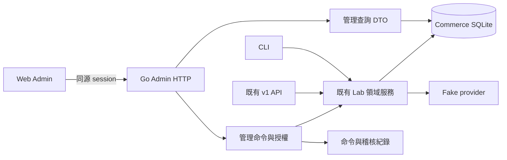

# Web Admin 設計方案

[English](05-web-admin.md) | **繁體中文** | [简体中文](05-web-admin.zh-CN.md)


狀態：截至 2026-10-03，Web Admin 實作與 A01–A30 本機驗收完成。原設計範圍不變，目前證據與限制以 [實作紀錄](../implementation/web-admin.zh-TW.md) 為準。

## 1. 目標與範圍

讓操作者可以在瀏覽器完成現有 CLI 的業務操作，並回答：客戶目前買了什麼、應付多少、實際付了多少、服務是否開通、哪一步待處理，以及下一步可以做什麼。

第一版沿用本機 Go＋SQLite、fake provider 與既有金額政策。提供完整功能入口、可理解的狀態、操作預覽與可追查的結果。真實金流、稅、多幣別、正式總帳及網際網路部署沿用原有 MVP 範圍限制。

**完成條件是下表全部功能可操作及查詢。** 分階段交付只是實作順序，不縮減最終範圍。模擬時間與故障注入也保留，但集中在清楚標示的「實驗室」頁面。

## 2. 現況與需要新增的部分

| 現況證據 | 設計含義 |
| --- | --- |
| `cmd/lab/menu.go` 有 13 組主選單，子選單涵蓋訂閱、付款、退款、用量、合約、對帳及兩種遷移 | 以完整 CLI 功能清單作為 Web 驗收基準 |
| `api/v1.go` 目前提供報價、新購、訂閱變更／查詢、發票／權益讀取、用量寫入與少量內部操作 | 不能只替現有 API 加表單；尚需管理查詢與命令介面 |
| `lab/inspect.go` 的 `State` 為 CLI 一次讀取全部資料 | Web 需要分頁、篩選、明確 DTO；不直接把整份 State 傳到瀏覽器 |
| CLI 與 HTTP 共用 `lab` 領域服務 | 金額計算與狀態檢查繼續由 Go 領域層負責 |
| `cmd/lab/serve.go` 僅允許 loopback；內部 API 使用伺服器設定的 token | 新增瀏覽器 session 與管理權限；內部 token 不放進前端 bundle |
| CLI 的模擬時鐘位於 menu instance；HTTP server 目前使用實際時鐘 | Web 的時間控制需要明確的 server clock 注入與隔離，不能假設已存在 |

來源：[互動 CLI](../implementation/interactive-cli.zh-TW.md)、[v1 API](../implementation/phase-p2-v1-api.zh-TW.md)、[帳戶遷移](../implementation/phase-p3-account-cutover.zh-TW.md)。

## 3. 導覽與功能覆蓋

左側導覽以工作目的命名；每個詳情頁均可連到相關客戶、訂閱、發票、付款與操作紀錄。

| 導覽／頁面 | 查詢內容 | 必須可操作的功能 | 主要領域來源 |
| --- | --- | --- | --- |
| 總覽 | 待查證付款／退款、待收帳單、grace／暫停訂閱、對帳差異、衝突遷移 | 進入待辦對象；重新整理觀測結果 | 管理查詢 DTO |
| 客戶與訂閱 | 客戶下訂閱、實際價與目標價、席次、帳期、revision、權益來源、時間軸 | Basic／Pro／已發布 SKU 報價及新購；下期方案變更；期末取消；取消生效前恢復；期中 Pro 升級 | `lab.go`、`subscription_changes.go`、`immediate.go` |
| 帳單與 credit | 原始 invoice lines、來源版本、減額更正、應付餘額、credit 來源與餘額、應用紀錄 | 減額更正；credit 套用後續帳單；延遲開通更正；未提供升級服務的補償 | `corrections.go`、`immediate.go` |
| 付款與退款 | payment obligation、嘗試、provider 觀測、分配；退款保留／已退／未知金額 | 建立部分或剩餘付款；確定失敗後重試；送出下一筆付款；依原 key 查證；保留退款額度、送出退款及查證 | `billing.go`、`refunds.go`、`lab.go` |
| 價格與產品 | PriceVersion、元件、checksum、meter、cohort 選價歷史 | 發布新 Pro 版本；註冊 meter；發布配置式計量價格；指定 cohort 新購價格 | `catalog_admin.go`、`meter_catalog.go` |
| 價格遷移 | 預覽逐戶差異、批次／項目狀態、衝突原因與新舊 assignment | 預覽、建立批次、暫停、略過衝突戶、重新檢查後恢復；反向遷移以新批次表達 | `price_migration.go` |
| 用量與關帳 | meter 事件、撤銷關係、帳期彙總、rating 版本、晚到差額與待過帳 credit note | 記錄事件、撤銷事件、關帳、晚到重算、過帳負差額 CreditNote | `usage.go` |
| 企業合約 | 客戶合約版本、席次／價格條款、期限、Net30 到期、後續價格或 hold | 發布合約；建立／接受合約報價；到期帳單送入收款佇列 | `contracts.go`、`contract_accept.go` |
| 對帳與修復 | run、discrepancy、expected／actual、證據、來源 revision、修復與再核對結果 | 執行對帳、查差異、指定修復／原 key 查詢、記錄人工決議 | `reconciliation.go`、`reconciliation_repair.go` |
| 帳戶遷移 | legacy/customer/beneficiary 映射、shadow、來源回填、read owner、writer owner、停止原因 | 建立映射；shadow 報價／權益比較；回填與審查修正；準備度檢查；切讀／切寫；停止新命令及遷移；adapter 查權益 | `account_migration.go` |
| 工作與操作紀錄 | 到期工作、outbox、管理命令、進度、結果連結與失敗原因 | 到期續約；重建權益；查詢或恢復既有命令。逐項修復沿用對帳入口 | `billing.go`、`entitlements.go`、新增管理命令紀錄 |
| 實驗室 | 模擬時間、fake provider 狀態與已啟用故障 | 調整模擬時間；設定下一筆付款／退款結果；支援 CLI 已有的遺失回應及中斷情境 | `cmd/lab/menu*.go`、`provider.go` |

「客戶」先是依現有 customer ID 彙整的管理檢視，不宣稱已經具備完整 CRM 或 billing account 模型。beneficiary、customer 與 legacy account 的區別在遷移頁清楚標出。

## 4. 頁面與互動設計

### 客戶／訂閱工作台

訂閱詳情作為最常使用的工作台：

```text
本機實驗室｜模擬時間／實際時間｜最近更新｜操作者
客戶 > 訂閱 sub_…                   [建立變更] [取消／恢復]
方案 Pro v1 · 5 席 · USD · revision 12

帳務：已付清    付款：已確認    服務：啟用    下期：預計 Pro v2

[概覽] [帳期與帳單] [付款／退款] [用量] [權益來源] [操作紀錄]

當期 09/01–10/01                  待處理
實際使用價格與席次                1 筆付款待查證 → 查看
已收／剩餘應付／可用 credit       權益來源 revision 11，訂閱 12 → 查看

時間軸：命令受理 → 帳單核定 → 付款觀測 → 權益更新
```

帳務、付款、服務及下期意圖分開顯示，不合併成一個容易誤解的「成功」。時間軸顯示各系統記錄時間與來源，不把顯示順序當成分散式因果順序。

桌面以約 224px 側欄、主內容及詳情抽屜呈現；表格支援搜尋、篩選、排序與分頁。抽屜只負責查看，複雜變更使用完整頁面或分步表單。URL 保存篩選及分頁位置，回上一頁不丟失工作上下文。窄螢幕保留主要資訊，複雜金額表格可水平捲動。

### 操作流程

1. **選擇對象與意圖**：從訂閱或發票頁開始，自動帶入對象；明示操作範圍。
2. **輸入與預覽**：顯示來源版本、目前／變更後席次、金額分解、生效時間、影響權益及不可執行原因。
3. **確認與提交**：金額或寫入者切換需要明確確認；輸入原因。一般讀取與重新整理不增加確認步驟。
4. **追蹤結果**：顯示命令受理、付款處理、領域完成、權益投影與修復驗證等不同階段；可離開頁面後再回來追蹤。

預覽不是保留額度，也不是執行成功。伺服器在實際命令交易內重新核對 revision、價格、席次、期限及額度。前端不計算權威金額，不靠隱藏按鈕維持不變條件。

### 報價及期中升級

報價同時顯示「現在應付」「下一整期固定承諾」「用量費率」「稅務未支援」。排程變更現在應付為 0。期中升級沿用 `due_now_estimated=true`，明示估算時刻與「提交時重新計算」。實際受理後以 `pending_amount_minor` 顯示付款義務，不能把預覽金額複製為收款依據。

新增管理用的確認預覽，回傳帶期限、操作者／對象／操作／request hash 的不透明 token；token 指向伺服器保存的資料，不能由瀏覽器自行改寫。金額敏感命令須有預覽版本與金額界限：執行時計算超過已確認金額，或變更影響範圍，回 `409 PREVIEW_STALE` 並要求重看。這是新增工作，現有 `v1` 尚未提供此保證。

期中升級若重算金額下降，允許在已確認上限內執行，結果列出估值與實際金額；上升則重新確認。退款及 credit 應用的明確金額不可自動替換。此政策是本提案的管理端決策，需在實作測試中固定。

### 例外狀態

| 情況 | 畫面與可執行行為 |
| --- | --- |
| 付款／退款 UNKNOWN | 顯示「結果待查證」、原操作與最後觀測時間；提供原 key 查詢，不提供新增同一義務的盲目重送 |
| 確定失敗 | 顯示原因；只有領域允許時開放重試，保留新舊嘗試關係 |
| revision 衝突 | 保留表單意圖、載入最新資料、顯示差異、重新預覽；不自動改 revision 再送出 |
| 報價過期或 catalog 改變 | 顯示原價／新價與原因，重新建立報價；不延長原報價 |
| 權益投影落後 | 分開顯示訂閱 revision 與權益來源 revision，標「同步中」並提供有權限的修復入口 |
| Net30 | 顯示「已開通／尚未付款／到期日」；零元現在應付不代表整份合約免費 |
| 已發布價格 | 唯讀；以「建立下一版本」操作，不出現編輯既有金額按鈕 |
| 價格遷移部分衝突 | 顯示逐戶狀態與原因；暫停阻止後續項目，不撤銷已生效項目 |
| 高風險對帳差異 | 展示證據與 expected／actual，記錄人工決議；人工決議本身不等於資金已修正 |
| 帳戶切寫後停止 | 顯示實際 read／writer owner 和停止範圍；停止不自動把 writer 切回 legacy |
| 網路逾時或頁面重整 | 查詢既有 command ID 或原 request key，恢復進度；不產生另一個金融意圖 |

狀態使用文字、圖示與顏色共同表示。表單需有鍵盤操作、明確標籤與欄位錯誤；確認框回復焦點。金額顯示幣別與格式化值，展開可看原始 minor units；rational 用量費率保持分子／分母，不以浮點近似值作運算。

## 5. 技術架構

採用已確認的 React＋TypeScript＋Vite，以 Ant Design 統一頁面骨架、表格、表單、對話框、訊息與狀態元件；使用 TanStack Query 管理讀取快取與背景更新，React Router 管理路由，Zod 驗證 API 資料與輸入格式。表單採 Ant Design Form，不再並用 React Hook Form 或 Radix UI。主題、元件邊界與金融操作限制見工程契約。Go 仍是唯一業務後端，SQLite 仍是本機資料來源。



前端原始碼放 `web/admin/`；新增管理 handler 放 `api/admin/`；管理查詢與命令交易協調放 `lab/admin_*.go`，重用領域 transaction helpers，避免另建第二套業務規則或循環依賴。

開發時 Vite proxy 到 Go；本機交付時將建置產物嵌入 Go binary，同一 origin 提供 `/admin/` 與 `/admin/api/`。保留現有 `serve` 命令相容性，新增獨立 `admin` 命令；管理 listener 不掛載未受管理授權的 v1 路由，目前尚無此命令。純 API build 不應因缺少前端 dist 而無法編譯。

第一版採輪詢工作進度與手動重新整理，保留最後觀測時間；無需先建立 WebSocket 系統。可見頁面輪詢，切換頁面時取消不用的請求。命令成功後只失效相關快取；金融寫入不使用樂觀更新假裝成功。

## 6. 管理 API 與命令契約

以下均為**擬新增的管理路由**，不是宣稱現有 v1 已具備。表內省略重複的 `/admin/api` 前綴。前端使用管理層 session，管理 handler 直接呼叫領域服務，不透過瀏覽器持有內部 API token。

| API 群組 | 擬提供讀取 | 擬提供命令 |
| --- | --- | --- |
| `/admin/api/overview`、`/customers`、`/subscriptions` | 分頁列表、搜尋、訂閱 detail 與 timeline | quotes、accept、schedule、cancel、resume、immediate-upgrade |
| `/invoices`、`/credits` | 帳單來源、餘額、credit 分配與退款額度 | reduction、apply-credit、late-activation-correction、unfulfilled-change-resolution |
| `/payments`、`/refunds` | 義務、嘗試、未知狀態、保留額度與結果 | create、retry-failed、dispatch、reconcile、reserve-refund |
| `/prices`、`/meters`、`/catalog-selections` | 元件、checksum、選價與歷史 | publish-price、register-meter、select-catalog-price |
| `/price-migrations` | 預覽、批次、逐戶進度與衝突 | plan、pause、skip-item、resume |
| `/usage-events`、`/usage-periods` | 事件、rating、晚到差額與 credit note | record、adjust、close、rerate、post-credit-notes |
| `/contracts` | 條款、到期、後續價與收款狀態 | publish、quote、accept、collect-due |
| `/reconciliation-runs`、`/discrepancies` | run、證據、修復前後結果 | run、repair、record-manual-decision |
| `/account-migrations` | 映射、來源、shadow、門檻、擁有者、adapter view | link、shadow、backfill、resolve-provenance、switch-read、switch-writer、stop |
| `/commands`、`/jobs` | 命令回應、可追蹤工作與復原狀態 | run-renewals、refresh-entitlements、受控工作執行 |
| `/lab` | server clock、fake provider 的隔離狀態 | set-clock、set-provider-decision、inject-supported-fault |

每個 mutation 定義專用 payload 與端點，例如 `POST /admin/api/subscriptions/{id}/cancel`；不接受任意函式名稱或 SQL。完整 OpenAPI 應與實作一起維護。

**讀取契約**：cursor 分頁、有界 limit、穩定排序、允許欄位的篩選、`as_of` 與適用的 `source_revision`。列表只顯示必要資訊；原 provider key 等診斷欄位以權限控制。跨頁總覽是有觀測時間的摘要，不宣稱與所有後續 detail 讀取共用同一 snapshot。

**命令契約**：對象 ID、typed payload、原因、`Idempotency-Key`、適用的 expected revision 與 preview token。actor 從 session 取得，不能相信瀏覽器自報的 actor ID。金額仍使用整數 minor units；跨 JS 安全整數範圍時用十進位字串傳送。新 Admin DTO 可以先一致使用字串，無需改動既有 v1。

新增持久化 `admin_commands`：command ID、actor、kind、target、request key、payload hash、預覽版本、狀態、結果引用、error code、建立／更新時間。request key 以 actor 與命令 scope 定義唯一性；相同 key 不同 payload 回衝突。命令查詢也要有物件與角色授權。

短命令可直接完成並回傳結果引用；可中斷／長時間工作回 `202` 與 command ID。HTTP 受理成功、命令已完成、付款已確認、服務已開通是不同的狀態。命令狀態至少有 `accepted/running/succeeded/failed/waiting_verification`；無法判定時不能寫成一般失敗並放行新嘗試。

**交易與復原是新增工程工作**：現有領域方法自行開 transaction，且 `Lab` 限制資料庫連線數；管理 wrapper 不可先持有 transaction 再呼叫它們。要在領域交易內與業務事實一起記錄 command receipt／audit；provider side effect 另走既有 outbox／operation key 並依原操作查證。每條路徑要處理「業務提交成功、命令紀錄尚未更新」的中斷，再由業務鍵查回既有結果。對原本缺少 request key 的批次工作，需補 job 身分與逐項冪等性，不能只加一張管理命令表就宣稱保證了重播。

## 7. 權限、稽核與實驗室隔離

本機版預設一名完整權限操作者，但所有管理 API 仍經同一 permission middleware；可用 `BILLFORGE_ADMIN_CAPABILITIES` 將該帳號限制為明列的能力，不需先開發帳號管理產品。從 `.env` 載入 `BILLFORGE_ADMIN_USERNAME`、`BILLFORGE_ADMIN_PASSWORD`，提供 `/admin/login` 帳密登入並建立伺服器 session；session cookie 使用 HttpOnly、SameSite，正式 HTTPS 時使用 Secure。寫入核對 Origin／CSRF，內部 token 不交給瀏覽器。僅綁 loopback 本身不足以防止其他網站觸發本機請求。

權限按 capability 定義：`read`、`subscription.manage`、`finance.adjust`、`catalog.publish`、`migration.manage`、`reconciliation.repair`、`operations.run`、`usage.manage`、`contract.manage`、`lab.control`。日後再組合成 support、finance、catalog admin 等角色；前端能力顯示與後端執行檢查同源。跨操作者及跨物件存取要有拒絕測試。

每次金融／批次命令保存 actor、reason、request ID、對象、來源版本、影響金額與結果引用。不可把完整憑證或敏感 provider payload 存進普通操作紀錄。現有領域 audit 尚不能直接當成完整的管理人員稽核軌跡；需要補充欄位及交易連結。

實驗室功能由 server 設定及 capability 同時控制，頁首永久顯示環境與時鐘；設定只影響指定本機環境，不在一般付款表單混入故障選項。改時間前顯示將影響的報價期限／帳期；調整時與執行中的命令協調，禁止同一命令在前後使用兩個模擬時刻。時間前進不偷偷執行收款；由操作者再觸發到期工作。

## 8. 實作順序與驗收

| 階段 | 交付 | 退出條件 |
| --- | --- | --- |
| W1 管理基礎與讀取 | 同源前端、session、權限、分頁 API、總覽、訂閱／發票詳情、共用狀態元件 | 在既有 fixture 正確呈現 paid、UNKNOWN、grace、Net30、投影落後；未授權 API 拒絕；舊 CLI／v1 回歸通過 |
| W2 訂閱工作流 | 新購、報價、排程、取消、恢復、期中升級、命令追蹤與預覽 | 報價席次／價格／revision 釘選；過期與陳舊預覽拒絕；重新整理後找回同一命令 |
| W3 金融與營運 | 付款、退款、credit、更正、續約、權益工作、對帳與人工決議 | 金額來源可追查；UNKNOWN 查原操作；重播不重複保留／付款；修復後有再核對結果 |
| W4 產品與計費平台 | 價格／meter、cohort、用量、合約、價格遷移 | 已發布價唯讀；晚到用量有新 rating 與差額；Net30 到期行為；遷移部分衝突不誤報全成功 |
| W5 帳戶遷移與實驗室 | 所有 P03 操作、模擬時鐘、fake provider 故障與狀態 | 不符合準備度無法切寫；停止範圍清楚；故障後仍能查證原操作；覆蓋表全部入口完成 |

以 Go domain tests 繼續驗證金額與交易規則；新增 HTTP contract tests 驗證授權、payload、錯誤、分頁、preview 與命令重播。Playwright 走真實本機 Go server、獨立暫存 SQLite 與 fake provider，驗證可見操作結果，避免只 mock 成功回應。

至少實際驗收以下完整流程：

- 新購 → 遺失付款回應 → UI 顯示待查證 → 原 key 查證 → 權益開通，只有一筆成功 capture。
- 下期排程與期中升級分別顯示正確應付時點；另一個操作者先改 revision 後，舊預覽拒絕且不產生帳單／付款。
- 減額更正 → funded credit → 套用部分／保留退款 → 退款 UNKNOWN → 查證，保留與可用額度正確且可回溯。
- 用量事件 → 關帳 → 晚到／撤銷 → 重算 → 正差額或 CreditNote，歷史 rating 保留。
- 價格遷移包含正常戶、衝突戶、暫停／恢復；已處理戶不因重播再次遷移。
- Net30 接受後先開通，收款只在到期時入列；缺少後續價時顯示 hold。
- 對帳發現差異 → 修復預覽 → revision 改變拒絕 → 重新核對後處理，結果提供證據與驗證 run。
- 帳戶 shadow／來源回填 → readiness → 切讀 → 切寫 → 停止；確認只有指定 writer 可接受新命令。
- 在「命令受理後」「業務 commit 後、管理回應前」中斷 server，再啟動或重新整理，找回同一結果且沒有第二筆金融義務。

初版不以營收成長報表當驗收目標。總覽先呈現可靠的營運待辦；若之後新增 MRR／ARR，另定義合約、退款、更正、用量與認列口徑，再建立報表。

## 9. 設計完成與實作交接

歷史 checkpoint（已由上方最終本機驗收取代）：本文件完成了導覽、全 CLI 能力對照、主要畫面、金額／狀態互動、後端缺口、管理端權限、分階段交付與驗收標準。下一步實作從 W1 開始，最終仍需完成 W1–W5 才能稱 Web Admin 完成。

價格／付款政策以既有 A–D 與實作文件為準。新的預覽金額上限、管理 session、命令持久化及稽核要求在本文標為新增設計；不得把本文件當成這些功能已存在的證據。

完整工程與執行交接：[06 工程契約](06-web-admin-contracts.zh-TW.md)、[07 實作計畫](07-web-admin-implementation-plan.zh-TW.md)、[08 驗收計畫](08-web-admin-test-plan.zh-TW.md)。此輪停留在設計與規劃，尚未啟動 W1 或建立實際帳密。
